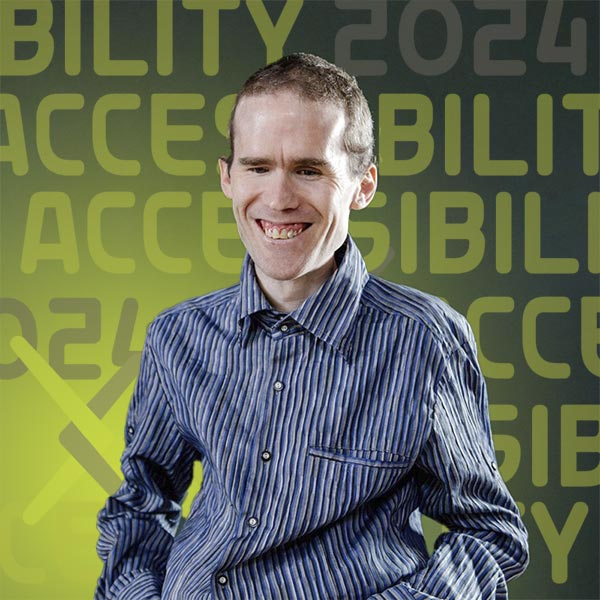
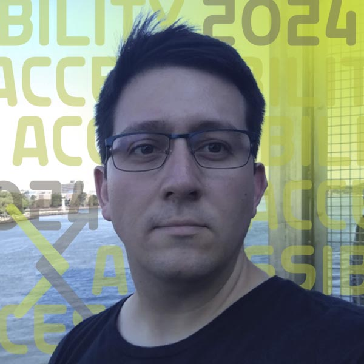
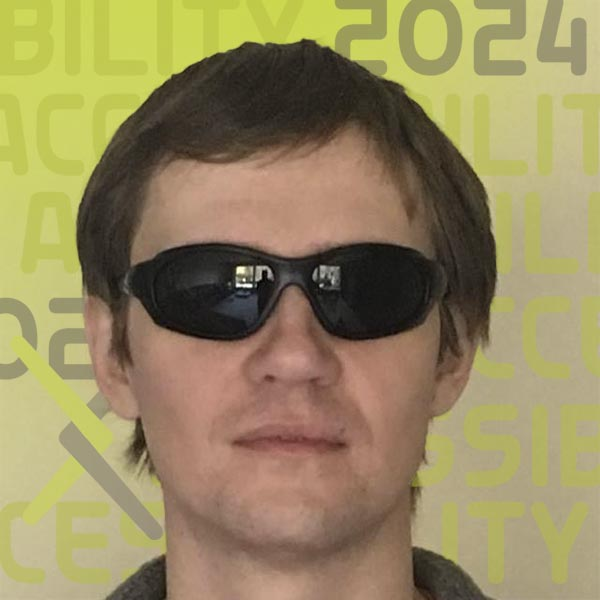
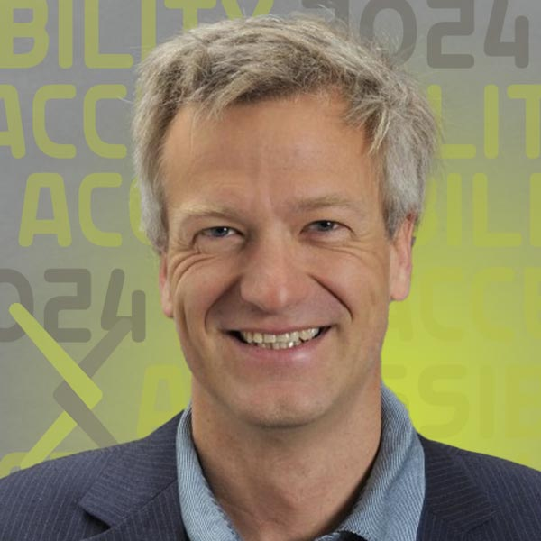

#HTML Papers On arXiv: A peek under the hood with LaTeXML and NVDA

{.mkd-img-right .mkd-spacing alt='logo for the arXiv forum' role="presentation"}

Adding HTML to arXiv was possible because of organizations whose long-standing commitments to accessibility and open-source software go back decades. Join four open-source software luminaries from the NVDA screenreader, the LaTeXML converter, and arXiv to take a peek under the hood of how HTML papers on arXiv are made, what is working well, and where there is room for improvement. Learn more about this impactful and popular feature with true experts from the realms of TeX, screen readers, HTML, and web standards.

**Join us for this double celebration of accessibility gains and open-source software!** Bring your questions and gain a deeper understanding of what really makes a more accessible research paper.

| Date | Time | Links |
|---|---|---|
| September 12th 2024 | 8:00 p.m. ET |  [Register](https://cornell.ca1.qualtrics.com/jfe/form/SV_eEZ1d27LF2fVM7Y) |
*(This event is optimized for Asia-Pacific and PST time zones)*

## Presenters

### Michael Curran

{.mkd-img-left .mkd-img-profile alt='Headshot of Michael wearing a blue striped shirt standing against a dark background'}

**Co-Founder and Lead Developer, NV Access Limited.**

Mick is the creator of NVDA, the world's only free and open-source screen reading software. NVDA has enabled more than 200,000 blind and vision impaired people worldwide to independently use computers. He brings expertise in accessibility for the web, international standards, software APIs, and best practice approaches to functional usability. [Mick's LinkedIn profile](https://au.linkedin.com/in/mdcurran){target="_blank"}

---

### Deyan Ginev

{.mkd-img-left .mkd-img-profile alt='Headshot of Deyan outdoors with a river in the background'}

**Creator of ar5iv.org and lead developer at LaTeXML; W3C Math Working Group Member; Ph.D. candidate in hiding (do not disturb).**

Deyan's main focus is to enhance the representation of mathematical expressions in rendered research papers, improving their accessibility, computational semantics, and enabling further reuse in a broader class of applications. [Deyan's Kwarc profile](https://kwarc.info/people/dginev/){target="_blank"}

---

### Tony Malykh

{.mkd-img-left .mkd-img-profile alt='Headshot of Tony Malykh wearing dark sunglasses against a tan background'}

**Software Engineer, Meta.**

Tony is a researcher in Machine Learning at Meta, an active contributor to the NVDA open-source screen reader codebase, as well as a consultant to arXiv's accessibility research project. [Tony's GitHub profile](https://github.com/mltony){target="_blank"}

---

### Dr. Norbert Preining

{.mkd-img-left .mkd-img-profile alt='Headshot of Norbert in a blue shirt and blazer smiling against a grey background'}

**Principal Software Engineer, arXiv.**

As the author of TeXLive (and though he objects to this characterization) Norbert is one of the world's leading experts on TeX. He joined arXiv in 2023 and is actively engaged in ongoing efforts to improve arXiv submission and HTML formatted papers. [Norbert's Homepage](https://www.preining.info/){target="_blank"}

[See all Forum presenters](presenters){class="button-reg"}

<!-- ## Session materials shared in advance -->

## Discussion
Use this discussion board to continue the conversation, ask questions, and share more resources around the social model of disability. See these [instructions](discussion-board.md) for setting up a free GitHub account.
