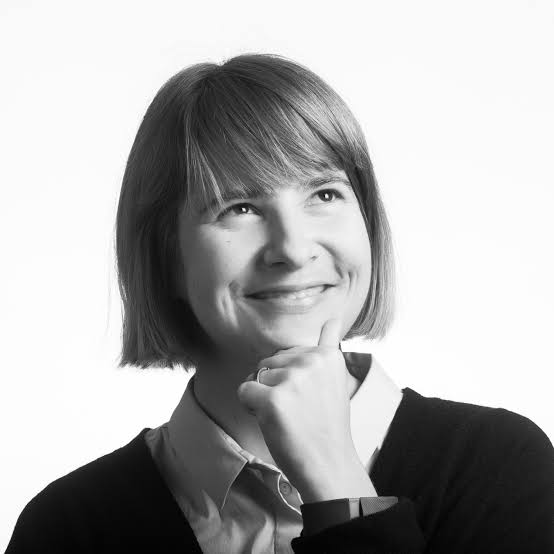
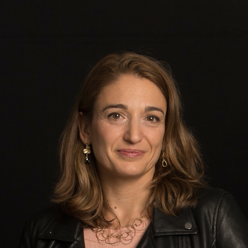

# SciELO y accessibilidad / e acessibilidade

{.mkd-img-right .mkd-spacing alt='logo for the arXiv forum' role="presentation"}

## Español
Una invitación a la comunidad SciELO: Estas invitado a un animado diálogo sobre cómo avanzar en la accesibilidad de las ciencias.

## Português
Um convite à comunidade SciELO: Você está convidado para um diálogo animado sobre o avanço da acessibilidade nas ciências.

## English
This groundbreaking session on accessibility in the SciELO community is also a first for arXiv: our first non-English event. It will be held only in Spanish and Portuguese with simultaneous translation between those two languages (not English). This session will dig into progress and next steps towards making scientific outputs more accessible in the SciELO community. SciELO is critical open-access publishing infrastructure that serves South America, Spain, Portugal, and more. If you are reading this English-language version you can still help by spreading the word to your Spanish- and Portuguese-speaking colleagues and let them know this event is taking place!

| Fecha/data | Hora | Liga/vínculo |
|---|---|---|
| El 11 de Septiembre / 11 de Setembro | 17:00 CEST/12:00 BRT| [Registro](https://cornell.ca1.qualtrics.com/jfe/form/SV_eEZ1d27LF2fVM7Y) |

## Presenters

### Luisa de Souza Leão  

**Master's Student in Special Education, Federal University of São Carlos (UFSCar).**

A psychologist by training, Luisa brings her expertise at the intersection of psychology, education and accessibility as well as her lived experience as an academic with a visual impairment. Outside her research career, she is a member of the Permanent Accessibility and Inclusion Committee of the Regional Labor Court of the 8th Region in Brazil. [Luisa's profile](){target="_blank"}

---

### Dr. Mar Gonzalez-Franco
{.mkd-img-left .mkd-img-profile alt='Black and white headshot of Mar smiling and looking thoughtfully upwards to the left while holding her chin'}

**Editor and Ethics and Diversity Chair, IEEE VGTC; Research Scientist, Google.**

Mar is a Computer Scientist and Neuroscientist working on a new generation of Immersive technologies and generative AI. To the forum, she brings in 4 years of expertise as the Ethics and Diversity Chair of IEEE VGTC, where she has significantly forwarded accessibility standards and regional diversity. [Mar's GitHub homepage](https://margonzalezfranco.github.io/){target="_blank"}

---

### Dr. Solange Maria dos Santos

{.mkd-img-left .mkd-img-profile alt='Candid photo of Solange smiling with a crowd of people in the background'}

**Production and Publishing Coordinator, SciELO.**

Solange brings in scientific communication expertise in diverse geographical contexts, such as Argentina, Bolivia, Colombia, Mexico, Paraguay, and South Africa. Solange is a strong advocate for accessibility in open archive space as well as academic journals. [Solange's LinkedIn profile](https://www.linkedin.com/in/solangemariasantos/?originalSubdomain=br){target="_blank"}

---

### Alex Mendonça

{.mkd-img-left .mkd-img-profile alt='Headshot of Alex Mendonça smiling in an indoor environment'}

**Online Submission & Preprints Coordinator, SciELO.**

Alex brings expertise in organizational strategies in transitioning from indexed journals to open science, as well as the implementation of Diversity, Equity, Inclusion and Accessibility (DEIA) policies at SciELO. [Alex's LinkedIn profile](https://www.linkedin.com/in/alex-mendon%C3%A7a/?originalSubdomain=br){target="_blank"}

---

### Dr. Licia Verde
{.mkd-img-left .mkd-img-profile alt='Headshot of Licia with dramatic lighting against a dark background'}

**Editor and Scientific Director of the Journal of Cosmology and Astroparticle Physics (JCAP); ICREA Professor, Institute of Cosmological Sciences, University of Barcelona.**

Licia's research is primarily on large-scale structure, analysis of the WMAP data, and development of rigorous statistical tools to analyze surveys of the universe. Licia brings multiple perspectives to her efforts in accessibility as an editor, researcher, author, and teacher. She is also a champion of open science and has served as Chair of the Science Advisory Committee at arXiv since 2019. [Licia's Faculty page](https://liciaverde.icc.ub.edu/){target="_blank"}

[See all presenter biographies](presenters)

## Session materials and resources
- The [SciELO e-book](https://25.scielo.org/en/we-so-loved-open-access/){target="_blank"} sheds lights on the ways that SciELO and other individuals from underrepresented regions in the sciences pushed forward open access in global academic communication. This e-book is published as part of SciELO's 25th anniversary celebration, and it is free to download for all.

## Discussion board
Use this discussion board to continue the conversation, ask questions, and share more resources around the social model of disability. See these [instructions](discussion-board.md) for setting up a free GitHub account.
