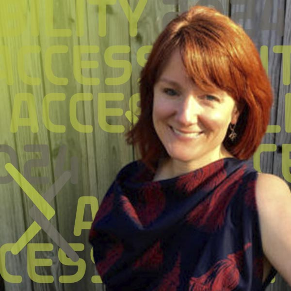
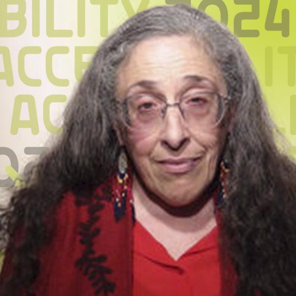
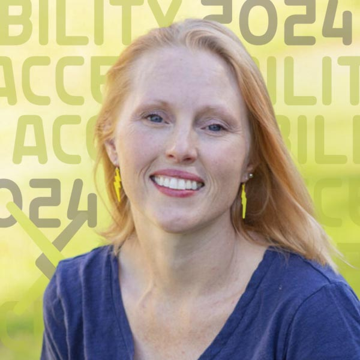

# Keynote: The Social Model of Disability

{.mkd-img-right .mkd-spacing alt='logo for the arXiv forum' role="presentation"}

After these three brilliant thought leaders, authors, and powerful advocates present on the social model of disability, the world around you will never feel the same. We are so excited about this transformative talk and hope you can join us.

This session is for anyone looking to contribute to and understand their role in creating environments where we can each achieve our potential.

| Date | Time | Links |
|---|---|---|
| September 6th 2024 | Noon Eastern Time | [Register](https://cornell.ca1.qualtrics.com/jfe/form/SV_eEZ1d27LF2fVM7Y) |

## Presenters

### Kim Bryant

{.mkd-img-left .mkd-img-profile alt='Headshot of Kim wearing a flowered shirt against a wooden wall'}

**Senior Staff Product Manager in Accessibility, Mozilla; Co-Founder of Disability@Mozilla, an internal employee resource group.**

Kim brings her expertise in interpreting accessibility through the lens of social sciences and empowering people with customizable accessibility toolboxes. In addition to her work at Mozilla, Kim is currently a Master's student in Disability Studies at the City University of New York (CUNY). [Kim's LinkedIn profile](https://www.linkedin.com/in/kimbryant/){target="_blank"}

---

### Dr. Devva Kasnitz
{.mkd-img-left .mkd-img-profile alt='Headshot of Devva Kasnitz in a red sweater and a red scarf against a white background'}

**Research Director, Disability History and Culture Collective and Adjunct Professor, CUNY.**

Devva's research work in disability studies spans more than 40 years at four distinguished universities. Her current work focuses on speech impairment, social participation politics, and disability services in higher education. With friends, she edited the book, "Occupying Disability," which explores concepts that consider disability not in terms of impairment but as a range of unique social identities and experiences. [Devva's Faculty Profile](https://sps.cuny.edu/about/directory/devva.kasnitz){target="_blank"}

---

### Dr. Ashley Shew

{.mkd-img-left .mkd-img-profile alt='Headshot of Ashley outdoors with the sun shining brightly on the lawn in the background'}

**Associate Professor of Science, Technology, and Society, Virginia Tech.**

Ashley specializes in disability studies and technology ethics and believes in cross-disciplinary, cross-disability, and public-facing scholarship. She is the author of Against Technoableism (2023) and Animal Constructions and Technological Knowledge (2017) and the co-editor-in-chief of *Techné: Research in Philosophy and Technology*. To the forum, she will bring in insights from her latest book and explore the harmful belief that the disabled simply await being 'fixed' by technological wizardry instead of making society more accessible and equitable. [Ashley's Faculty page](https://liberalarts.vt.edu/departments-and-schools/department-of-science-technology-and-society/faculty/ashley-shew.html){target="_blank"}

[See all Forum presenters](presenters){class="button-reg"}

<!-- ## Session materials and resources -->

## Discussion board
Use this discussion board to continue the conversation, ask questions, and share more resources around the social model of disability. See these [instructions](discussion-board.md) for setting up a free GitHub account.
