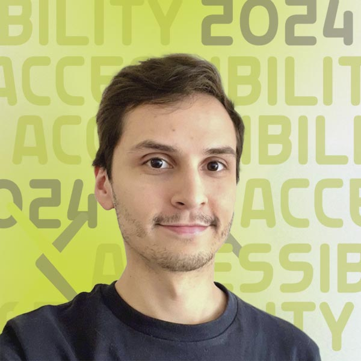
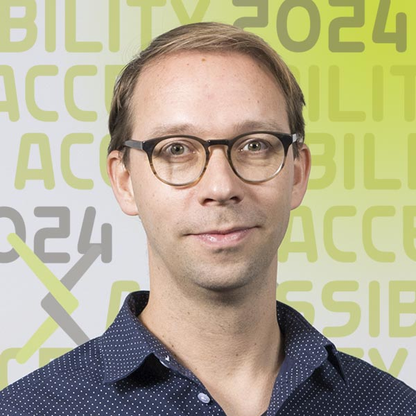
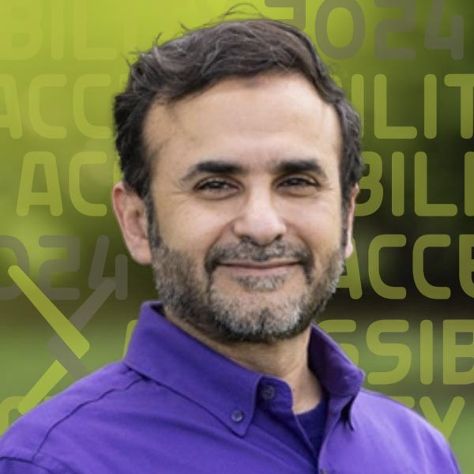
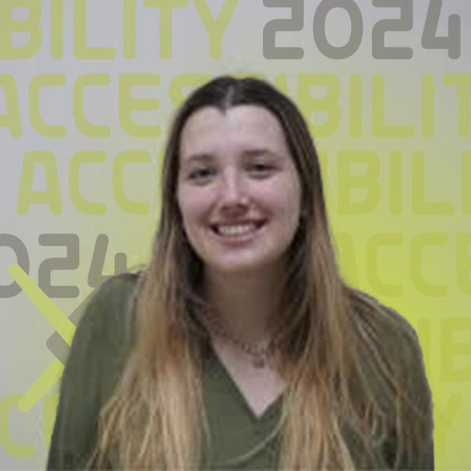

# AI and Accessibility: Emerging Tools Demonstration

{.mkd-img-right .mkd-spacing alt='logo for the arXiv forum' role="presentation"}

Has the bleeding edge finally caught up with user needs? This session features demonstrations from two research teams discussing their AI-driven tools for accessibility. The discussions are led by a vision-impaired scientist who uses AI tools daily to improve accessibility in her work.

This session is for everyone seeking practical insights into AI's role in accessibility and the opportunity for hands-on experience with two emerging AI tools.

| Date | Time |
|---|---|
| Wednesday, September 4, 2024  | 12:00 pm ET |

## Presenters

### Arwa Alnajashi

{.mkd-img-left .mkd-img-profile alt='An image of an iconic building in Saudi Arabia, the Al Faisaliah Tower in Riyadh'}

**Data Scientist, Saudi Aramco.**

Arwa's passion lies in creating an empowered and inclusive digital future, ensuring that advancements in technology pave the way for greater accessibility and efficiency across industries. Currently, she applies data science to automate critical operations in the oil and gas industry. [Arwa's LinkedIn Page](https://sa.linkedin.com/in/arwa-alnajashi-84b1541a2?trk=people-guest_people_search-card){target="_blank"}

---

### Ricardo Enrique Gonzalez
{.mkd-img-left .mkd-img-profile alt='Headshot of Ricardo in a dark shirt against a light grey background'}

**Ph.D. Candidate in Information Science, Cornell Tech.**

Ricardo designs interactive systems that empower people of disabilities, particularly Blind and Low Vision users, in 3D virtual environments, data analysis, AI powered systems, and mobile cameras. [Ricardo's GitHub homepage](https://rgonzalezp.github.io/){target="_blank"}

---

### Dr. Thijs Jan Roumen

{.mkd-img-left .mkd-img-profile alt='Headshot of Thijs Roumen against a grey background'}

**Assistant Professor of Information Science and Director of the Matter of Tech Lab, Cornell Tech.**

Thijs' research focus is digital fabrication, a nascent subfield of human-computer interaction (HCI). He aims to create a technological basis that allows designers and engineers to build on each other's work and enable personal, custom fabrication relevant to everyone, not only to industrialists and hobbyists. [Thijs's Homepage](http://thijsroumen.eu/){target="_blank"}

---

### Dr. Raafat Mahmoud Zaini
{.mkd-img-left .mkd-img-profile alt='Headshot of Raafat Zaini in a purple shirt against a background of greenery'}

**Assistant Professor, College of Integrated Science and Engineering, James Madison University.**

Raafat specializes in modeling dynamic systems, with a research focus that encompasses organizational design, dissent, change, strategy, cognitive learning, higher education, and human systems. Bringing a wealth of practical experience to his academic pursuits, Raafat teaches systems thinking, creative problem-solving, and designing future-forward organizations. Most recently, he has been passionate about harnessing generative AI to improve accessibility for visually impaired and neurodiverse learners. [Raafat's Faculty page](https://www.jmu.edu/cise/people/faculty/zaini-raafat.shtml){target="_blank"}

---

### Allie Zombron
{.mkd-img-left .mkd-img-profile alt='Headshot of Allie  smiling in a green sweater in a classroom setting'}

**Fourth-year undergraduate student, James Madison University.**

Allie's research focuses on pairing AI with systems thinking to drive inclusivity in STEM Education. She will share her project that uses AI to explain, interpret and verbalize flow chart visualizations, a common presentation choice in academic research outputs. Analyzing such figures and turning them into words greatly enhances their accessibility for visually impaired academics. [Allie's LinkedIn Page](https://www.linkedin.com/in/allie-zombron-87394a290/){target="_blank"}

[See all Forum presenters](presenters){class="button-reg"}

## Session materials and resources
Want to learn more about system design? Check out these 2 resources shared by our presenters.

- [System Dynamics Learning Guide](https://pressbooks.lib.jmu.edu/sdlearningguide/)
- [Thinking in Systems by Dana Meadows](https://research.fit.edu/media/site-specific/researchfitedu/coast-climate-adaptation-library/climate-communications/psychology-amp-behavior/Meadows-2008.-Thinking-in-Systems.pdf)

## Discussion board
Use this discussion board to continue the conversation, ask questions, and share more resources around the social model of disability. See these [instructions](discussion-board.md) for setting up a free GitHub account.
