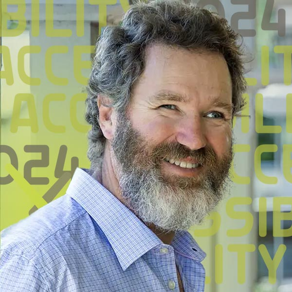
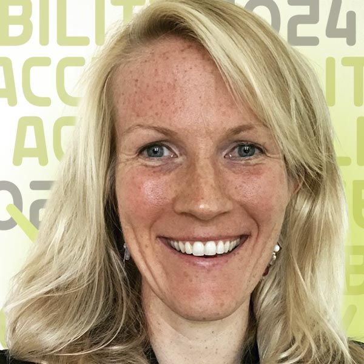
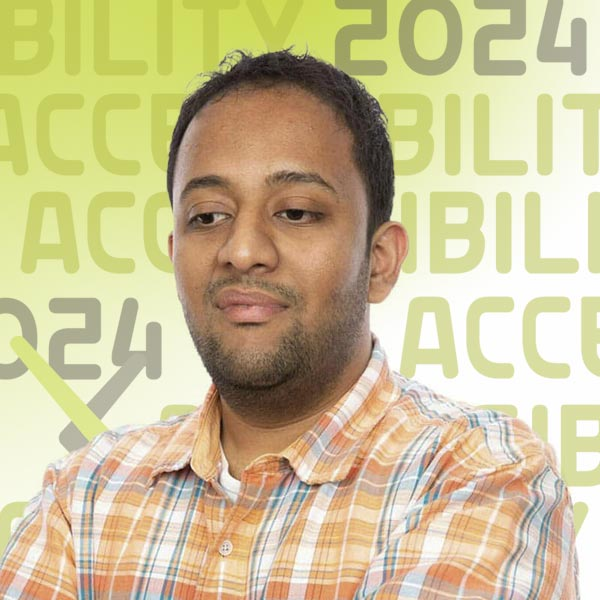

#Ask Me Anything: A Lively Q&A on Navigating Academic Ecosystems With a Disability

{.mkd-img-right .mkd-spacing alt='logo for the arXiv forum' role="presentation"}

One of the biggest accessibility barriers is social: the discomfort that gets in the way of connection, friendship, and truly understanding the needs of those around us. We are often not sure what we can or should ask. Three brilliant researchers with diverse disabilities and at different academic career stages are here to cut through the fog and answer your questions.

There are no silly questions. Come engage and learn!

| Date | Time | Links |
|---|---|---|
| Tuesday, September 3, 2024 | 4:00 pm ET |  If you haven't already, [signup](https://cornell.ca1.qualtrics.com/jfe/form/SV_eEZ1d27LF2fVM7Y) for the Forum |

## Presenters

### Dr. Jonathan Godfrey
{.mkd-img-left .mkd-img-profile alt='Headshot of Jonathan Godfrey smiling in a suit'}

**Senior Lecturer in Statistics, School of Mathematical and Computational Sciences, Massey University.**

Jonathan's research is focused on the needs of the thousands of blind people around the world who rely on additional tools to make the visual elements of statistical thinking and practice less of a barrier. In addition, Jonathan was a core consultant to arXiv's efforts towards HTML papers. [Jonathan's Faculty profile](https://www.massey.ac.nz/massey/expertise/profile.cfm?stref=416430){target="_blank"}

---

### Dr. Anne Kearney Logan

{.mkd-img-left .mkd-img-profile alt='Headshot of Anne Logan smiling against a white background'}

**Adjunct Professor, Gallaudet University.**

A horticulturalist with a focus in Viticulture and Enology, Anne currently teaches as an adjunct professor at Gallaudet University and creates STEM videos for deaf / HoH children for educational game app company ASL Aspire. She soon will launch her own wine education program in ASL. [Anne's LinkedIn profile](https://www.linkedin.com/in/anne-k-logan-9a75b989/){target="_blank"}

---

### Dr. Venkatesh Potluri

{.mkd-img-left .mkd-img-profile alt='Headshot of Venkatesh in an orange plaid shirt against a white background'}

**Assistant Professor, School of Information, University of Washington.**

Venkatesh examines accessibility barriers experienced by blind or visually impaired (BVI) developers participating in professional programming domains such as user interface design, data science, and physical computing. His work contributes real-world systems to improve developer tools and new interaction techniques. [Venkatesh's Homepage](https://venkateshpotluri.me/){target="_blank"}

[See all Forum presenters](presenters){class="button-reg"}

<!-- ## Session materials and resources -->

## Discussion board
Use this discussion board to continue the conversation, ask questions, and share more resources around the social model of disability. See these [instructions](discussion-board.md) for setting up a free GitHub account.
