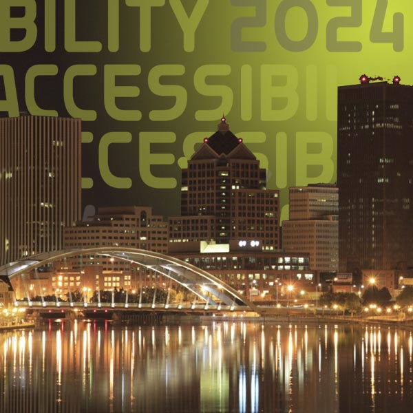
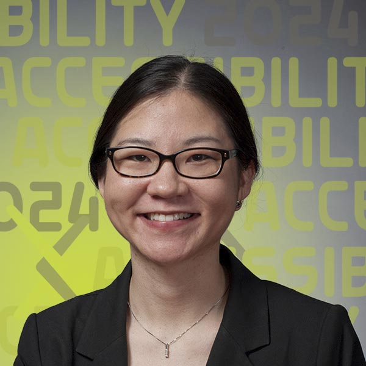

# Deaf Hub at RIT: A Resource For All Of Us

  

    
Have you ever wondered how deaf or hard of hearing researchers navigate academia? Have you wondered how you can help make academic spaces (including your own presentations) accessible to all? Join Deaf Hub colleagues and friends to learn more about the deaf and deaf-blind experience and how this incredible treasure trove of resources has helped students and professors... and can help you too.

  

  

    <h2>Welcome video from the Deaf Hub team!</h2>
    <iframe src="https://www.youtube.com/embed/rjFvfz34G1g?si=BYo3UGwyV39OZ-XL" title="YouTube video player" frameborder="0" allow="accelerometer; autoplay; clipboard-write; encrypted-media; gyroscope; picture-in-picture; web-share" referrerpolicy="strict-origin-when-cross-origin" allowfullscreen></iframe>
  

Deaf Hub is based at Rochester Institute of Technology's National Technical Institute for the Deaf and is a resource open to the entire scientific community.

This session is for all academics who want to give or get support navigating academic settings.

| Date | Time | Link |
|---|---|---|
| Friday, September 6, 2024 | 12:00 pm ET | [Sign up](https://cornell.ca1.qualtrics.com/jfe/form/SV_eEZ1d27LF2fVM7Y) |

## Participate

- [Sign up](https://cornell.ca1.qualtrics.com/jfe/form/SV_eEZ1d27LF2fVM7Y){target="_blank"} for the accessibility forum
- Enjoyed the teaser video and have more questions? [Submit your questions](https://cornell.ca1.qualtrics.com/jfe/form/SV_bBqisDGVGcrzQeq) ahead of time. The presenters are eager to hear from you in advance so they can answer as many of them as possible during the session.
- Help get the word out by sharing this free and important event with your colleagues and other academic networks. Session posters and links are available on [the share page](/share).

## Presenters

### Elizabeth Ayers

{.mkd-img-left .mkd-img-profile alt='Headshot of Liz wearing a black shirt against a dark grey background'}

**Senior Lecturer, Department of Science and Mathematics and Director of Healthcare Mentoring, Deaf Healthcare and Biomedical Sciences Hub (Deaf Hub), National Technical Institute for the Deaf at Rochester Institute of Technology.**

Liz is a sonographer at Highland Hospital and science instructor at NTID/RIT teaching science to deaf and hard of hearing undergraduate students. She runs the Mentor Supported Shadowing Program at Deaf Hub. In addition, Liz is a current University at Buffalo doctoral student almost at dissertation. [Liz's RIT profile](https://www.rit.edu/directory/ewants-elizabeth-ayers){target="_blank"}

---

### Hannah DeFelice

{.mkd-img-left .mkd-img-profile alt='A night photograph of Rochester's iconic city skyline with the famous Frederich Douglas and Susan B Anthony bridge in the foreground'}

**Master's Student in Environmental Science, Rochester Institute of Technology.**

Hannah’s research focuses on permaculture, especially carbon cycles and their impact. [Hannah's profile](){target="_blank"}

---

### Dr. Bonnie Jacob (Moderator)
{.mkd-img-left .mkd-img-profile alt='Headshot of Bonnie against a clear dark grey background'}

**Associate Professor, Department of Science and Mathematics and National Technical Institute for the Deaf, Rochester Institute of Technology.**

Bonnie is passionate about promoting undergraduate research in mathematics as well as STEM in general, particularly among deaf and hard-of-hearing students. She is a mathematician by training, specializing in graph theory and combinatorial matrix theory. [Bonnie's RIT profile](https://www.rit.edu/directory/bcjntm-bonnie-jacob){target="_blank"}

---

### Dyl Levenson

{.mkd-img-left .mkd-img-profile alt='Headshot of Dyl in a dark grey polo with the RIT logo on the lapel standing against a dark grey background'}

**Biomedical Science Training Grants Admin, National Technical Institute for the Deaf, Rochester Institute of Technology.**

Dyl is the coordinator for undergraduate and graduate research training programs in the biomedical, biobehavioral, and clinical fields at Deaf Hub. He is also a grad student in health systems management. [Dyl’s RIT profile](https://www.rit.edu/directory/djldhb-dyl-levenson){target="_blank"}

---

### Dr. Carmody McCalley

{.mkd-img-left .mkd-img-profile alt='Headshot of Carmody in a blue blazer smiling against a grey background'}

**Associate Professor in Life Sciences and Director of Environmental Science MS Program, Rochester Institute of Technology.**

Carmody's research focuses on better understanding ecosystem and climate interactions like the thawing of the Arctic permafrost. Carmody will share her experiences working with and supporting students with accessibility needs on their academic journeys, both in and outside the classroom. [Carmody's Faculty profile](https://www.rit.edu/directory/ckmsbi-carmody-mccalley){target="_blank"}

---

### Camille Ouellette

{.mkd-img-left .mkd-img-profile alt='Headshot of Camille in a suit and wearing black-rimmed glasses standing against a grey background'}

**Senior Lecturer of Biology and Health Sciences at Rochester Institute of Technology; Deaf Hub Affiliate.**

Camille teaches in the Biology and Health department on Human Health and Disease, and is an active faculty member supporting deaf and hard of hearing (DHH) researchers throughout their academic journeys. Camille empowers students by connecting them to the resources they need. [Camille's RIT profile](https://www.rit.edu/directory/ceonts-camille-ouellette){target="_blank"}

[See all Forum presenters](presenters){class="button-reg"}

## Session materials and resources
- [Slide deck on presenter introductions in welcome video](https://docs.google.com/presentation/d/1DqvdU9F0na_WjIiJO1uUH8fjLovSZwJbUr-MdzSC_Ck/edit?usp=sharing)

## Discussion board
Use this discussion board to continue the conversation, ask questions, and share more resources around the social model of disability. See these [instructions](discussion-board.md) for setting up a free GitHub account.
