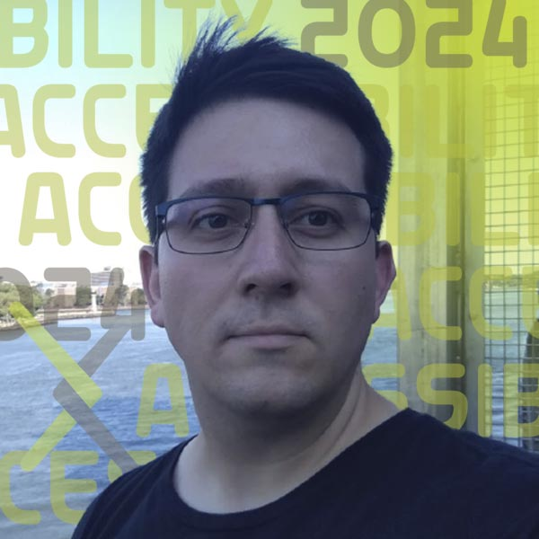
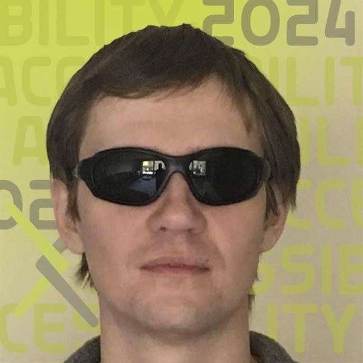

#HTML Papers On arXiv: A peek under the hood with LaTeXML and NVDA

  

    
arXiv added HTML as a paper format in December 2023. This impactful change was only possible because of organizations whose long-standing commitments to accessibility and open-source software go back decades. Join four open-source software luminaries from the NVDA screenreader, the LaTeXML converter, and arXiv to take a peek under the hood of how HTML papers on arXiv are made, what is working well, and where there is room for improvement.

  

  

    
<H2>Session Recording</h2>
    <iframe src="https://www.youtube.com/embed/Lq_F4vkfqV0?si=tsY9SQZXT7VdZfFt" title="YouTube video player" frameborder="0" allow="accelerometer; autoplay; clipboard-write; encrypted-media; gyroscope; picture-in-picture; web-share" referrerpolicy="strict-origin-when-cross-origin" allowfullscreen></iframe>

  

<h2>Technical Demonstration</h2>

  <iframe src="https://www.youtube.com/embed/wUvFYwLxFM8?si=CNuZvmCEFlnVw5LD" title="YouTube video player" frameborder="0" allow="accelerometer; autoplay; clipboard-write; encrypted-media; gyroscope; picture-in-picture; web-share" referrerpolicy="strict-origin-when-cross-origin" allowfullscreen style="width:100%;" class="shadow"></iframe>

| Session Date | Time | Link |
|---|---|---|
| Thursday, September 12, 2024 | 8:00 pm ET | [Webinar link](https://cornell.zoom.us/j/92772646280?pwd=nN9qJXOPnDZ9kdFUsVYDciuL5M4oXA.1) |
*(This event was optimal for Asia-Pacific and PST time zones)*

<!--
## Get ready:
<ul class="forum-actions">
  <li class="col">
    
1

    <h3>Sign Up</h3>
    
<a href="https://cornell.ca1.qualtrics.com/jfe/form/SV_eEZ1d27LF2fVM7Y" target="_blank">Sign up</a> for free. The forum is open to everyone.

    <a class="button-reg" href="https://cornell.ca1.qualtrics.com/jfe/form/SV_eEZ1d27LF2fVM7Y" target="_blank">Sign up</a>
  </li>
  <li class="col">
    
2

    <h3>Watch videos</h3>
    
Watch the <a href="https://youtu.be/PYBgeITZhL4?feature=shared" target="blank">welcome video</a>, the <a href="">demo video</a>, and <a href="https://www.youtube.com/playlist?list=PLYgeAMJvRZ6ZRuNQGoekx0FdjXqEG0bzM" target="blank">more</a>.

    <a class="button-reg" href="https://youtu.be/PYBgeITZhL4?feature=shared" target="blank">Watch</a>
  </li>
  <li class="col">
    
3

    <h3>Ask Questions!</h3>
    
<a href="https://cornell.ca1.qualtrics.com/jfe/form/SV_bBqisDGVGcrzQeq" target="_blank">Submit your questions</a> in advance. The presenters will love you!

    <a class="button-reg" href="https://cornell.ca1.qualtrics.com/jfe/form/SV_bBqisDGVGcrzQeq" target="_blank">Ask</a>
  </li>
</ul>

Then help get the word out by sharing this free and important event with your colleagues and other academic networks. Session posters and links are available on [the share page](/share). -->

## Presenters

### Michael Curran

{.mkd-img-left .mkd-img-profile alt='Headshot of Michael wearing a blue striped shirt standing against a dark background'}

**Co-Founder and Lead Developer, NV Access Limited.**

Mick is the creator of NVDA, the world's only open-source screen reading software. NVDA has enabled more than 200,000 blind and vision impaired people worldwide to independently use computers. He brings expertise in accessibility for the web, international standards, software APIs, and best practice approaches to functional usability. [Mick's LinkedIn profile](https://au.linkedin.com/in/mdcurran){target="_blank"}

---

### Deyan Ginev

{.mkd-img-left .mkd-img-profile alt='Headshot of Deyan outdoors with a river in the background'}

**Creator of ar5iv.org and lead developer at LaTeXML; W3C Math Working Group Member; Ph.D. candidate in hiding (do not disturb).**

Deyan's main focus is to enhance the representation of mathematical expressions in rendered research papers, improving their accessibility, computational semantics, and enabling further reuse in a broader class of applications. [Deyan's KWARC profile](https://kwarc.info/people/dginev/){target="_blank"}

---

### Tony Malykh

{.mkd-img-left .mkd-img-profile alt='Headshot of Tony Malykh wearing dark sunglasses against a tan background'}

**Software Engineer, Meta.**

Tony is a researcher in Machine Learning at Meta, an active contributor to the NVDA open-source screen reader codebase, as well as a consultant to arXiv's accessibility research project. [Tony's GitHub profile](https://github.com/mltony){target="_blank"}

---

### Dr. Norbert Preining

{.mkd-img-left .mkd-img-profile alt='Headshot of Norbert in a blue shirt and blazer smiling against a grey background'}

**Principal Software Engineer, arXiv.**

As the author of TeXLive (and though he objects to this characterization) Norbert is one of the world's leading experts on TeX. He joined arXiv in 2023 and is actively engaged in ongoing efforts to improve arXiv submission and HTML formatted papers. [Norbert's Homepage](https://www.preining.info/){target="_blank"}

[See all Forum presenters](presenters){class="button-reg"}

<!-- ## Session materials shared in advance -->

## Discussion
Use this discussion board to continue the conversation, ask questions, and share more resources around HTML conversions and making research accessible. See these [instructions](discussion-board.md) for setting up a free GitHub account.
