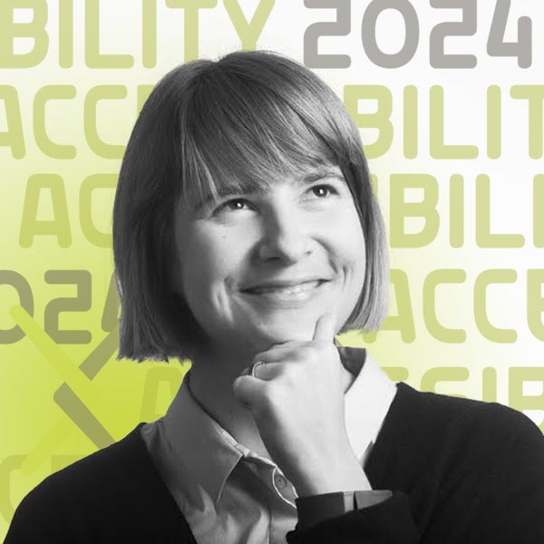
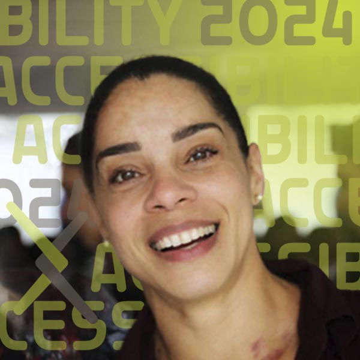
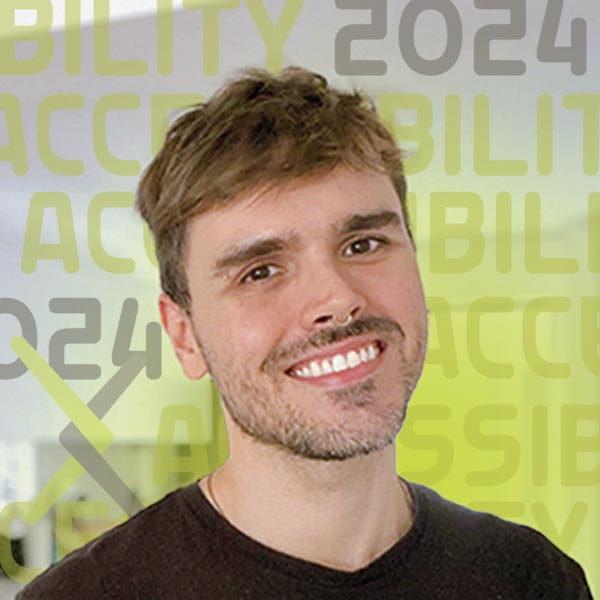
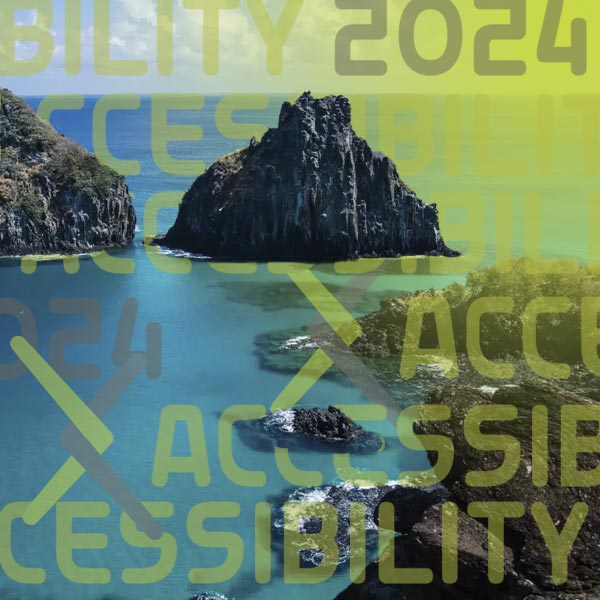
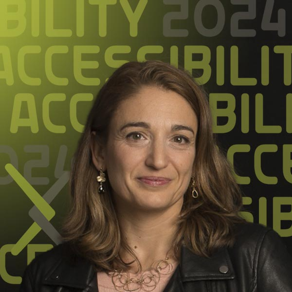

<html lang="es">

# SciELO y Accessibilidad

{.mkd-img-right .mkd-spacing alt='logo for the arXiv forum' role="presentation"}

[Português](forum-session-SciELO-pt.md){.button-reg}
[English](forum-session-SciELO.md){.button-reg}

Está cordialmente invitado a esta sesión sobre la publicación de artículos accesibles en la comunidad SciELO.

Esta sesión innovadora sobre accesibilidad en la comunidad SciELO profundizará en el progreso y los próximos pasos para hacer que los productos científicos sean más accesibles.  SciELO es una parte fundamental de la infraestructura editorial de acceso abierto que presta servicios en América del Sur, España, Portugal y más allá. Únase a SciELO y a los editores de revistas de Física e Ingeniería para aprender más sobre los desafíos y oportunidades de publicar investigaciones accesibles.

Esta sesión también es la primera para arXiv: nuestro primer evento en un idioma no inglés. Se realizará en español y portugués con traducción simultánea entre los dos idiomas (no inglés).

## Fecha y Hora
| Fecha | Hora |
|---|---|
| El 11 de Septiembre | 5:00 pm CEST / 12:00 pm BRT |

## Ver Video de Bienvenida

1. {target="_blank"}
    **[SciELO y accessibilidad](https://youtu.be/wjzYB1DTbe0?si=9MRmZ6vWvI5j-LNS){target="_blank"}**

## Enviar Preguntas para Q&A
El contenido le resulta fascinante y tiene muchas ganas de participar? Informe a los presentadores sus preguntas enviándolas antes de la sesión en vivo en septiembre.

[Enviar Preguntas](https://cornell.ca1.qualtrics.com/jfe/form/SV_bBqisDGVGcrzQeq){class="button-reg"}

## Presentadores

### Dr. Mar Gonzalez-Franco
{.mkd-img-left .mkd-img-profile alt='foto en blanco y negro de Mar sonriendo y mirando pensativamente hacia arriba a la izquierda mientras se sostiene la barbilla.'}

**Editor y Presidente de Ética y Diversidad, IEEE VGTC; Investigador científico, Google.**

Mar es informática y neurocientífica que trabaja en una nueva generación de tecnologías inmersivas e IA generativa. Al foro, aporta cuatro años de experiencia como presidenta de Ética y Diversidad de IEEE VGTC, donde ha impulsado significativamente los estándares de accesibilidad y la diversidad regional. [Página de inicio de GitHub de Mar](https://margonzalezfranco.github.io/){target="_blank"}

---

### Dr. Solange Maria dos Santos

{.mkd-img-left .mkd-img-profile alt='foto sincera de Solange sonriendo con una multitud de personas al fondo'}

**Coordinadora de Producción y Publicación, SciELO.**

Solange aporta su experiencia en comunicación científica en diversos contextos geográficos, como Argentina, Bolivia, Colombia, México, Paraguay y Sudáfrica. Solange es una firme defensora de la accesibilidad en el acceso abierto y los espacios de archivo abiertos, así como en las revistas académicas. [Perfil de LinkedIn de Solange](https://www.linkedin.com/in/solangemariasantos/?originalSubdomain=br){target="_blank"}

---

### Alex Mendonça

{.mkd-img-left .mkd-img-profile alt='Foto de cabeza de Alex Mendonça sonriendo en un ambiente interior'}

**Coordinador de Envíos Online y Preprints, SciELO.**

Alex aporta experiencia en estrategias organizacionales en la transición de revistas indexadas a ciencia abierta, así como en la implementación de políticas de Diversidad, Equidad, Inclusión y Accesibilidad (DEIA) en SciELO. [Perfil de LinkedIn de Alex](https://www.linkedin.com/in/alex-mendon%C3%A7a/?originalSubdomain=br){target="_blank"}

---

### Luisa de Souza Leão  
{.mkd-img-left .mkd-img-profile alt='una imagen de una hermosa zona natural escénica en Brasil que presenta una costa rocosa y afloramientos de islas cerca de la costa.'}

**Estudiante de Maestría en Educación Especial, Universidad Federal de São Carlos (UFSCar).**

Luisa, psicóloga de formación, aporta su experiencia en la intersección de la psicología, la educación y la accesibilidad, así como su experiencia vivida como académica con discapacidad visual. Fuera de su carrera investigadora, es miembro del Comité Permanente de Accesibilidad e Inclusión del Tribunal Regional del Trabajo de la 8ª Región de Brasil. 

---

### Dr. Licia Verde
{.mkd-img-left .mkd-img-profile alt='foto de la cabeza de Licia con una iluminación espectacular sobre un fondo oscuro'}

**Editor y Director Científico de la Revista de Cosmología y Física de Astropartículas (JCAP); Profesor ICREA, Instituto de Ciencias Cosmológicas, Universidad de Barcelona.**

La investigación de Licia se centra principalmente en la estructura a gran escala, el análisis de los datos WMAP y el desarrollo de herramientas estadísticas rigurosas para analizar estudios del universo. Licia aporta múltiples perspectivas a sus esfuerzos en materia de accesibilidad como editora, investigadora, autora y docente. También es una defensora de la ciencia abierta y se ha desempeñado como presidenta del Comité Asesor Científico de arXiv desde 2019. Página de la facultad de Licia. [Página de la facultad de Licia](https://liciaverde.icc.ub.edu/){target="_blank"}

[Ver todos los presentadores del foro](presenters){class="button-reg"}

## Panel de discusión
Utilice este foro de discusión para continuar la conversación, hacer preguntas y compartir más recursos sobre el modelo social de discapacidad. Consulte estas instrucciones para configurar una cuenta de GitHub gratuita.

