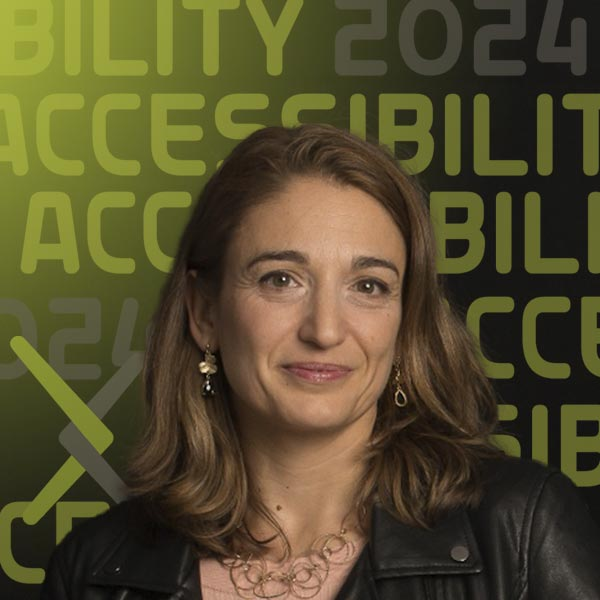

<html lang="pt">

# SciELO e Acessibilidade

[Español](forum-session-SciELO-es.md){.button-reg}
[English](forum-session-SciELO.md){.button-reg}

Você está calorosamente convidado para esta sessão sobre publicação de artigos acessíveis na comunidade SciELO.

Esta sessão inovadora sobre acessibilidade na comunidade SciELO irá se aprofundar no avanço  e  próximos passos para tornar a produção científica mais acessível.  O SciELO é uma parte crítica da infraestrutura de publicação de acesso aberto que atende a América do Sul, Espanha, Portugal e outros países. Junte-se ao SciELO e aos editores de revistas de Física e Engenharia para saber mais sobre os desafios e oportunidades na publicação de pesquisas acessíveis.

Esta sessão também é a primeira do arXiv: nosso primeiro evento em idioma diferente do inglês. A sessão será realizada em espanhol e português com tradução simultânea entre os dois idiomas (não inglês).

## Data e Hora
| Data | Hora |
|---|---|
| 11 de Setembro | 5:00 pm CEST / 12:00 pm BRT |

## Ver Video de Boas-vindas

1. {target="_blank"}
    **[SciELO e acessibilidade](https://youtu.be/wjzYB1DTbe0?si=9MRmZ6vWvI5j-LNS){target="_blank"}**

## Enviar Perguntas para Q&A
Acha o conteúdo fascinante e está ansioso para participar? Deixe suas perguntas aos apresentadores enviando-as antes da sessão ao vivo em setembro.

[Enviar Perguntas](https://cornell.ca1.qualtrics.com/jfe/form/SV_bBqisDGVGcrzQeq){class="button-reg"}

## Apresentadores

### Dr. Mar Gonzalez-Franco
{.mkd-img-left .mkd-img-profile alt='foto em preto e branco de Mar sorrindo e olhando pensativamente para cima, e para a esquerda, enquanto segura o queixo'}

**Editor e Presidente de Ética e Diversidade, IEEE VGTC; Cientista pesquisador, Google.**

Mar é Cientista da Computação e Neurocientista, que trabalha com uma nova geração de tecnologias imersivas e IA generativa. Para o fórum, ela traz 4 anos de experiência como Presidente de Ética e Diversidade do IEEE VGTC, onde promoveu significativamente padrões de acessibilidade e diversidade regional. [Página inicial do GitHub da Mar](https://margonzalezfranco.github.io/){target="_blank"}

---

### Dr. Solange Maria dos Santos

{.mkd-img-left .mkd-img-profile alt='Foto espontânea de Solange sorrindo com uma multidão ao fundo'}

**Coordenadora de Produção e Publicação, SciELO.**

Solange traz experiência em comunicação científica em diversos contextos geográficos, como Argentina, Bolívia, Colômbia, México, Paraguai e África do Sul. Solange é uma forte defensora da acessibilidade em espaços de acesso aberto e arquivo abertos, bem como em periódicos acadêmicos. [Perfil de Solange no LinkedIn](https://www.linkedin.com/in/solangemariasantos/?originalSubdomain=br){target="_blank"}

---

### Alex Mendonça

{.mkd-img-left .mkd-img-profile alt='Foto de Alex Mendonça sorrindo em ambiente interno}

**Coordenador de Submissão Online e Preprints, SciELO.**

Alex traz experiência em estratégias organizacionais na transição de periódicos indexados para ciência aberta, bem como na implementação de políticas de Diversidade, Equidade, Inclusão e Acessibilidade (DEIA) no SciELO. [Perfil de Alex no LinkedIn](https://www.linkedin.com/in/alex-mendon%C3%A7a/?originalSubdomain=br){target="_blank"}

### Luisa de Souza Leão  
{.mkd-img-left .mkd-img-profile alt='uma imagem de uma bela área cênica natural no Brasil com um litoral rochoso e afloramentos de ilhas perto da costa'}

**Mestranda em Educação Especial pela Universidade Federal de São Carlos (UFSCar).**

Psicóloga de formação, Luisa traz sua experiência na intersecção entre psicologia, educação e acessibilidade, bem como sua experiência vivida como acadêmica com deficiência visual. Fora da carreira acadêmica, é membro da Comissão Permanente de Acessibilidade e Inclusão do Tribunal Regional do Trabalho da 8ª Região do Brasil.

---

### Dr. Licia Verde
{.mkd-img-left .mkd-img-profile alt='Foto do rostode Licia com iluminação dramática contra um fundo escuro'}

**Editora e Diretora Científica do Journal of Cosmology and Astroarticle Physics (JCAP); Professora ICREA, Instituto de Ciências Cosmológicas, Universidade de Barcelona.**

A pesquisa de Licia concentra-se principalmente em estrutura em grande escala, análise de dados WMAP e desenvolvimento de ferramentas estatísticas rigorosas para analisar do universo. Licia traz múltiplas perspectivas para seus esforços em acessibilidade como editora, pesquisadora, autora e professora. Ela também é uma defensora da ciência aberta e atua como presidente do Comitê Consultivo Científico do arXiv desde 2019. [Página do corpo docente de Licia](https://liciaverde.icc.ub.edu/){target="_blank"}

[Veja todos os apresentadores do Fórum](presenters){class="button-reg"}

## Fórum de discussão
Use este fórum de discussão para continuar a conversa, fazer perguntas e compartilhar mais recursos sobre o modelo social da deficiência. Consulte estas [instruções](discussion-board.md) para configurar uma conta GitHub gratuita.