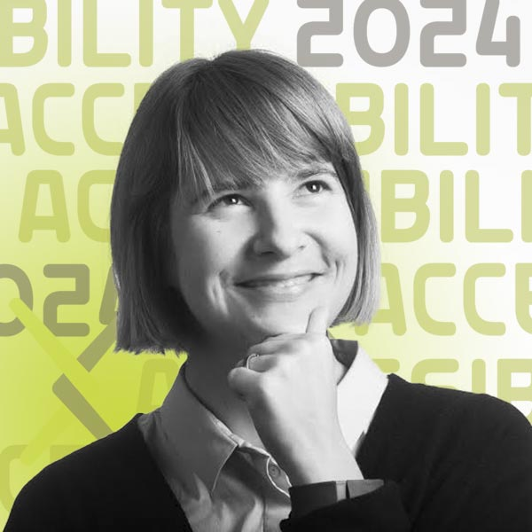

# SciELO y accessibilidad / e acessibilidade

{.mkd-img-right .mkd-spacing alt='logo for the arXiv forum' role="presentation"}

## Español
Está cordialmente invitado a esta sesión sobre la publicación de artículos accesibles al publico en la plataforma-comunidad SciELO

Esta sesión innovadora sobre accesibilidad en la plataforma/comunidad SciELO profundizará en el progreso y los próximos pasos para hacer que los productos científicos sean más accesibles.  SciELO es una parte fundamental de la infraestructura editorial de acceso abierto que presta servicios en América del Sur, España, Portugal y más allá. Únase a SciELO y a los editores de revistas de Física e Ingeniería para aprender más sobre los desafíos y oportunidades de publicar investigaciones accesibles

## Português
Você está calorosamente convidado para esta sessão sobre publicação de artigos acessíveis na comunidade SciELO.

Esta sessão inovadora sobre acessibilidade na comunidade SciELO irá se aprofundar no avanço  e  próximos passos para tornar a produção científica mais acessível.  O SciELO é uma parte crítica da infraestrutura de publicação de acesso aberto que atende a América do Sul, Espanha, Portugal e outros países. Junte-se ao SciELO e aos editores de revistas de Física e Engenharia para saber mais sobre os desafios e oportunidades na publicação de pesquisas acessíveis.

## English
This groundbreaking session on accessibility in the SciELO community is also a first for arXiv: our first non-English event. It will be held only in Spanish and Portuguese with simultaneous translation between those two languages (not English). This session will dig into progress and next steps towards making scientific outputs more accessible in the SciELO community. SciELO is critical open-access publishing infrastructure that serves South America, Spain, Portugal, and more. If you are reading this English-language version you can still help by spreading the word to your Spanish- and Portuguese-speaking colleagues and let them know this event is taking place!

| Fecha/data | Hora |
|---|---|
| El 11 de Septiembre / 11 de Setembro | 17:00 CEST/12:00 BRT|

## Presenters

### Dr. Mar Gonzalez-Franco
{.mkd-img-left .mkd-img-profile alt='Black and white headshot of Mar smiling and looking thoughtfully upwards to the left while holding her chin'}

**Editor y Presidente de Ética y Diversidad, IEEE VGTC; Investigador científico, Google.**

**Editor e Presidente de Ética e Diversidade, IEEE VGTC; Cientista pesquisador, Google.**

Mar es informática y neurocientífica que trabaja en una nueva generación de tecnologías inmersivas e IA generativa. Al foro, aporta cuatro años de experiencia como presidenta de Ética y Diversidad de IEEE VGTC, donde ha impulsado significativamente los estándares de accesibilidad y la diversidad regional. Página de inicio de GitHub de Mar

Mar é Cientista da Computação e Neurocientista, que trabalha com uma nova geração de tecnologias imersivas e IA generativa. Para o fórum, ela traz 4 anos de experiência como Presidente de Ética e Diversidade do IEEE VGTC, onde promoveu significativamente padrões de acessibilidade e diversidade regional. [Página inicial do GitHub da Mar](https://margonzalezfranco.github.io/){target="_blank"}

---

### Dr. Solange Maria dos Santos

{.mkd-img-left .mkd-img-profile alt='Candid photo of Solange smiling with a crowd of people in the background'}

**Coordinadora de Producción y Publicación, SciELO.**

**Coordenadora de Produção e Publicação, SciELO.**

Solange aporta su experiencia en comunicación científica en diversos contextos geográficos, como Argentina, Bolivia, Colombia, México, Paraguay y Sudáfrica. Solange es una firme defensora de la accesibilidad en el acceso abierto y los espacios de archivo abiertos, así como en las revistas académicas. [Perfil de LinkedIn de Solange](https://www.linkedin.com/in/solangemariasantos/?originalSubdomain=br){target="_blank"}

Solange traz experiência em comunicação científica em diversos contextos geográficos, como Argentina, Bolívia, Colômbia, México, Paraguai e África do Sul. Solange é uma forte defensora da acessibilidade em espaços de acesso aberto e arquivo abertos, bem como em periódicos acadêmicos. [Perfil de Solange no LinkedIn](https://www.linkedin.com/in/solangemariasantos/?originalSubdomain=br){target="_blank"}

---

### Alex Mendonça

{.mkd-img-left .mkd-img-profile alt='Headshot of Alex Mendonça smiling in an indoor environment'}

**Coordinador de Envíos Online y Preprints, SciELO.**

**Coordenador de Submissão Online e Preprints, SciELO.**

Alex aporta experiencia en estrategias organizacionales en la transición de revistas indexadas a ciencia abierta, así como en la implementación de políticas de Diversidad, Equidad, Inclusión y Accesibilidad (DEIA) en SciELO. [Perfil de LinkedIn de Alex](https://www.linkedin.com/in/alex-mendon%C3%A7a/?originalSubdomain=br){target="_blank"}

Alex traz experiência em estratégias organizacionais na transição de periódicos indexados para ciência aberta, bem como na implementação de políticas de Diversidade, Equidade, Inclusão e Acessibilidade (DEIA) no SciELO. [Perfil de Alex no LinkedIn](https://www.linkedin.com/in/alex-mendon%C3%A7a/?originalSubdomain=br){target="_blank"}

---

### Luisa de Souza Leão  
{.mkd-img-left .mkd-img-profile alt='an image of a beautiful natural scenic area in Brazil featuring a rocky coastline and island outcroppings near the shore'}

**Estudiante de Maestría en Educación Especial, Universidad Federal de São Carlos (UFSCar).**

**Mestranda em Educação Especial pela Universidade Federal de São Carlos (UFSCar).**

Luisa, psicóloga de formación, aporta su experiencia en la intersección de la psicología, la educación y la accesibilidad, así como su experiencia vivida como académica con discapacidad visual. Fuera de su carrera investigadora, es miembro del Comité Permanente de Accesibilidad e Inclusión del Tribunal Regional del Trabajo de la 8ª Región de Brasil.

Psicóloga de formação, Luisa traz sua experiência na intersecção entre psicologia, educação e acessibilidade, bem como sua experiência vivida como acadêmica com deficiência visual. Fora da carreira acadêmica, é membro da Comissão Permanente de Acessibilidade e Inclusão do Tribunal Regional do Trabalho da 8ª Região do Brasil.

---

### Dr. Licia Verde
{.mkd-img-left .mkd-img-profile alt='Headshot of Licia with dramatic lighting against a dark background'}

**Editor y Director Científico de la Revista de Cosmología y Física de Astropartículas (JCAP); Profesor ICREA, Instituto de Ciencias Cosmológicas, Universidad de Barcelona.**

**Editora e Diretora Científica do Journal of Cosmology and Astroarticle Physics (JCAP); Professora ICREA, Instituto de Ciências Cosmológicas, Universidade de Barcelona.**

La investigación de Licia se centra principalmente en la estructura a gran escala, el análisis de los datos WMAP y el desarrollo de herramientas estadísticas rigurosas para analizar estudios del universo. Licia aporta múltiples perspectivas a sus esfuerzos en materia de accesibilidad como editora, investigadora, autora y docente. También es una defensora de la ciencia abierta y se ha desempeñado como presidenta del Comité Asesor Científico de arXiv desde 2019. Página de la facultad de Licia.

A pesquisa de Licia concentra-se principalmente em estrutura em grande escala, análise de dados WMAP e desenvolvimento de ferramentas estatísticas rigorosas para analisar do universo. Licia traz múltiplas perspectivas para seus esforços em acessibilidade como editora, pesquisadora, autora e professora. Ela também é uma defensora da ciência aberta e atua como presidente do Comitê Consultivo Científico do arXiv desde 2019. [Página do corpo docente de Licia](https://liciaverde.icc.ub.edu/){target="_blank"}

[See all Forum presenters](presenters){class="button-reg"}

## Session materials and resources
- The [SciELO e-book in English](https://25.scielo.org/en/we-so-loved-open-access/){target="_blank"} sheds lights on the ways that SciELO and other individuals from underrepresented regions in the sciences pushed forward open access in global academic communication. This e-book is published as part of SciELO's 25th anniversary celebration, and it is free to download for all.

## Discussion board
Use this discussion board to continue the conversation, ask questions, and share more resources around the social model of disability. See these [instructions](discussion-board.md) for setting up a free GitHub account.
