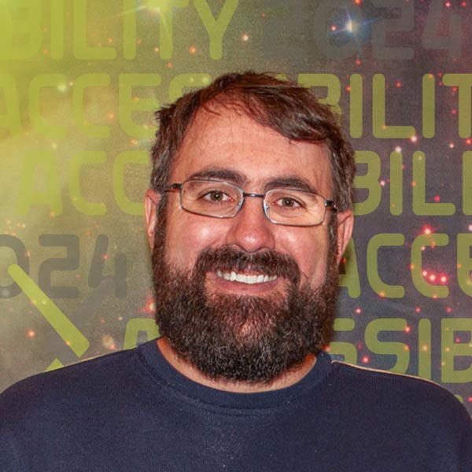

#Sonification: Why Multi-Modal Science is the Future

  

    
Join some of the world's leading experts on sonification to go beyond the visual and learn how all our senses can be engaged in exploring and understanding data. This session will demonstrate and discuss how sonification is used across multiple fields including astronomy, statistics, volcanology, oceanography and education. Hear from the researchers behind prominent sonification tools on how (and why) they use it in their daily work, and why multi-modal scientific outputs are a win for accessibility and the future of science.

  

  

    
<h2>Session Recording</h2>
    <iframe src="https://www.youtube.com/embed/HFDKQa5FSNI?si=9y3IGOvWb1WzeFXl" title="YouTube video player" frameborder="0" allow="accelerometer; autoplay; clipboard-write; encrypted-media; gyroscope; picture-in-picture; web-share" referrerpolicy="strict-origin-when-cross-origin" allowfullscreen></iframe>

  

| Session Date | Time | Link |
|---|---|---|
| Tuesday, September 10, 2024 | 3:00 pm ET | [Webinar link](https://cornell.zoom.us/j/95303704836?pwd=bnIanuPLl7mJvdHGIq5VDsdiEhhuYT.1) |

<!--
## Get ready:
<ul class="forum-actions">
  <li class="col">
    
1

    <h3>Sign Up</h3>
    
<a href="https://cornell.ca1.qualtrics.com/jfe/form/SV_eEZ1d27LF2fVM7Y" target="_blank">Sign up</a> for free. The forum is open to everyone.

    <a class="button-reg" href="https://cornell.ca1.qualtrics.com/jfe/form/SV_eEZ1d27LF2fVM7Y" target="_blank">Sign up</a>
  </li>
  <li class="col">
    
2

    <h3>Watch videos</h3>
    
Watch the <a href="https://youtu.be/IK5ZSD4nm6w?si=pv_5YIItPaVMqfqt" target="blank">welcome video</a> and the technical demos listed below.

    <a class="button-reg" href="https://youtu.be/IK5ZSD4nm6w?si=pv_5YIItPaVMqfqt" target="blank">Watch</a>
  </li>
  <li class="col">
    
3

    <h3>Ask Questions!</h3>
    
<a href="https://cornell.ca1.qualtrics.com/jfe/form/SV_bBqisDGVGcrzQeq" target="_blank">Submit your questions</a> in advance. The presenters will love you!

    <a class="button-reg" href="https://cornell.ca1.qualtrics.com/jfe/form/SV_bBqisDGVGcrzQeq" target="_blank">Ask</a>
  </li>
</ul>

Then help get the word out by sharing this free and important event with your colleagues and other academic networks. Session posters and links are available on [the share page](/share). -->

## Technical Demonstrations

1. {target="_blank"}
    **[Listening to ocean currents with Amy](https://youtu.be/f6r5BVZ93pk?si=Yzszw5RkUuiu-7SS){target="_blank"}**

2. {target="_blank"}
    **[Statistical sensemaking through sound with Robin](https://youtu.be/Qs6pr2UPYZ4?si=8_PFmGbWeDJgH651){target="_blank"}**

3. {target="_blank"}
    **[Introducing young learners to sonification with Phia](https://youtu.be/HEalOA_IqMs?si=zxpr6fq1mF9793y7){target="_blank"}**

4. {target="_blank"}
    **[Composing the music of volcanos with Leif](https://youtu.be/XE3MmvPFQWE?si=uAYXJzwySDHhrHzr){target="_blank"}**

5. {target="_blank"}
    **[Hearing a star's brightness with Scott](https://youtu.be/CQgHPd1S0uI?si=nhLghyHt7H2ioYNJ){target="_blank"}**

<!-- ## Submit Questions for Q&A
Finding the content fascinating and eager to participate? Let the presenters know your questions by submitting them ahead of the live session in September.

[Submit Questions](https://cornell.ca1.qualtrics.com/jfe/form/SV_bBqisDGVGcrzQeq){class="button-reg"} -->

## Presenters

### Phia Damsma

{.mkd-img-left .mkd-img-profile alt='Headshot of Phia Damsma in black-rimmed glasses against a white background'}

**Co-Founder and Creative Director, Sonokids Australia.**

Phia has more than 25 years of experience building innovative educational software and mobile apps for children with special needs, especially kids who are blind and low-vision. Her not-for-profit social enterprise, Sonokids, is impacting children globally, supporting playful learning with fundamental technology and other Expanded Core Curriculum skills through the technique of sonification. [Phia's LinkedIn profile](https://au.linkedin.com/in/phia-damsma-18b3a29){target="_blank"}

---

### Dr. Scott Fleming

{.mkd-img-left .mkd-img-profile alt='Headshot of Scott wearing glasses and smiling against a background image of a galaxy'}

**Archive Scientist at the Mikulski Archive for Space Telescopes (MAST), Space Telescope Science Institute (STScI).**

Scott studies stars and exoplanets in the ultraviolet, optical, and infrared. He is one of the movers and shakers behind Astronify, an open-source sonification tool written in Python and used for analyzing data from NASA’s space telescopes. [Scott's STSI profile](https://www.stsci.edu/stsci-research/research-directory/scott-fleming){target="_blank"}

---

### Sarah Kane

{.mkd-img-left .mkd-img-profile alt='Headshot of Sarah Kane smiling in a forest'}

**Ph.D. Candidate in Astrophysics, Institute of Astronomy, University of Cambridge.**

For Sarah, her career as a researcher is intertwined with her work as a disability advocate. She was born legally blind and has a strong interest in the accessibility of science to people with disabilities. Her work includes usability testing for Astronify, a project of the Space Telescope Science Institute turning datasets into audio. [Sarah's LinkedIn profile](https://uk.linkedin.com/in/sarah-kane-4a9414220){target="_blank"}

---

### Dr. Leif Karlstrom

{.mkd-img-left .mkd-img-profile alt='Upper-body shot of Leif Karlstrom standing in front of a snowy mountain with rough surfaces'}

**Associate Professor, Department of Earth Sciences, University of Oregon.**

Leif is an Earth scientist studying fluid motions in and on volcanoes and glaciers, landscape evolution, and geodynamics. He is also the creator of the Volcano Listening Project which takes data from erupting volcanoes and turns it into sound, and then constructs it into music. Did we mention he also plays violin and mandolin? [Leif's faculty profile](https://pages.uoregon.edu/leif/){target="_blank"}

---

### Kate Meredith (Moderator)

{.mkd-img-left .mkd-img-profile alt='Headshot of Kate in a red sweater against a grey background'}

**Founder and President, Geneva Lake Astrophysics and STEAM (GLAS) Education.**

Kate is committed to ensuring that all who want the opportunity to pursue careers in STEAM have the chance to do so, with a clear focus on accessibility and multigenerational engagement. Some of her projects at GLAS include creating accessible curricula and data analysis software, and hosting summer intern programs and public star parties. [Kate's LinkedIn profile](https://www.linkedin.com/in/kmeredith){target="_blank"}

---

### Dr. Robin Williams

{.mkd-img-left .mkd-img-profile alt='An image of the famous Big Ben clocktower and the houses of parliament in London, England'}

**Data analyst, Atass Sports.**

Robin completed his PhD in statistical methods for weather forecasting, before moving to industry where he works as a research statistician in sports prediction. During his PhD he helped to develop the Sonify R package, which he uses regularly to convert 2D data to sound. He also has an interest in anything that helps to make STEM subjects more accessible to visually impaired people. [Robin’s R Package page](https://cran.r-project.org/web/packages/sonify/index.html){target="_blank"}

[See all Forum presenters](presenters){class="button-reg"}

## Special Contributor
### Dr. Amy Bower

{.mkd-img-left .mkd-img-profile alt='Headshot of Amy'}

**Senior Scientist, Physical Oceanography, Woods Hole Oceanographic Institution.**

Amy's research focuses on ocean circulation. As one of the few blind oceanographers in the world, Amy brings her unique insights to illustrate the use of sonification in her day-to-day work and through museum exhibits. [Amy's WHOI profile](https://www.whoi.edu/profile/abower/){target="_blank"}

## Research and resources

- The [Astronify Python Package](https://astronify.readthedocs.io/) from Scott Fleming and Kate Meredith
- The [Sonify R Package](https://cran.r-project.org/web/packages/sonify/index.html) from Robin Williams
- The [The Volcano Listening Project](https://www.volcanolisteningproject.org/) from Leif Karlstrom
- The [CosmoBally on Sonoplanet App](https://www.sonoplanet.com/) from Phia Damsma
- Video: [Hearing the Light - Astronomy Data Sonification](https://www.youtube.com/watch?v=-MBpGKoULyc){target="_blank"}. A presentation by Scott Fleming about Astronify. Test your listening skills with an interactive sonification game show. Also download the [accompanying slides](https://stsci.box.com/s/h3b7ul8keeoltojqy2abwfgmiyj1zrol){target="_blank"}.
- Paper: Damsma, P. (2024). Hearing a circle: An exploratory study of accessible sonification for young children with blindness and low vision. *British Journal of Visual Impairment*, 0(0). [https://doi.org/10.1177/02646196241253534](https://doi.org/10.1177/02646196241253534){target="_blank"}
- Paper: Damsma, P., Norgaard, J. T., & Cashmore, C. (2023, June 26–30). Accessible sonification design for young learners [Conference session]. In: Sonification for the Masses: Proceedings of the 28th International Conference on Auditory Display (ICAD2023), Norrköping, Sweden (pp. 280–282). [https://hdl.handle.net/1853/72890](https://hdl.handle.net/1853/72890){target="_blank"}
- Paper: Gower, L. & Damsma, P. (2023). How to use Sonification in the classroom. JSPEVI Journal of the South Pacific Educators in Vision Impairment, 16 (1), 44-53. [https://www.spevi.net/jspevi/#2023](https://www.spevi.net/jspevi/#2023){target="_blank"}

## Discussion board
Use this discussion board to continue the conversation, ask questions, and share more resources around sonification. See these [instructions](discussion-board.md) for setting up a free GitHub account.
