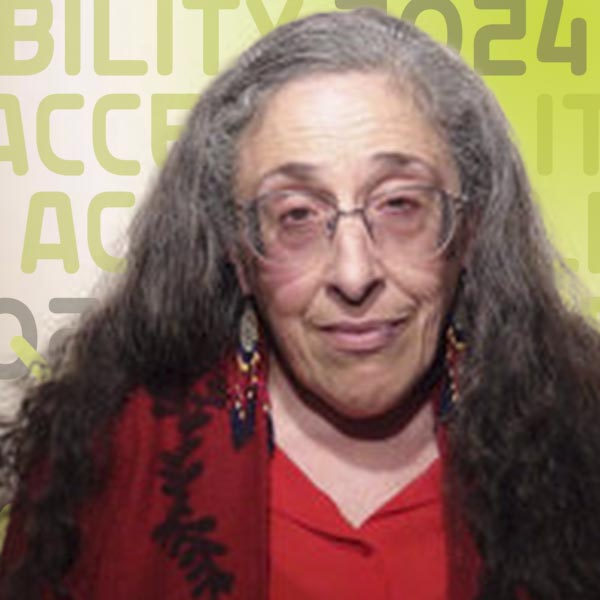
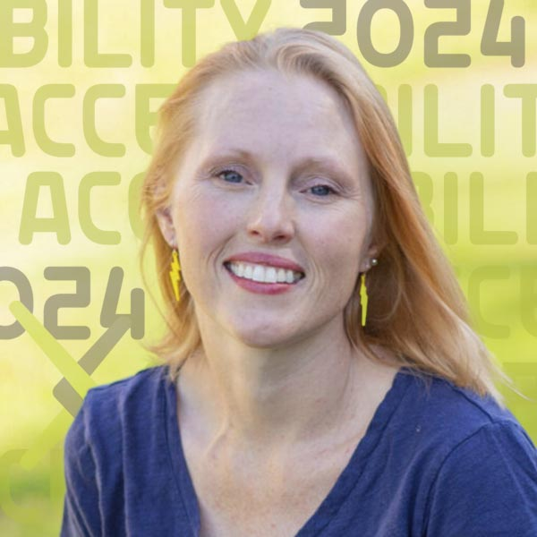

# Keynote: Universal Designs for Research

{.mkd-img-right .mkd-spacing alt='logo for the arXiv forum' role="presentation"}

There is no one right way to approach accessibility, but understanding different approaches can help us be much more accessible. After these three brilliant thought leaders, authors, and powerful advocates share their understanding of accessibility you wont experience the world in quite the same way again. We are so excited about this transformative talk and hope you can join us.

This session is for everyone who wants to contribute to environments where we can all achieve our potential.

| Session Date | Time | Link |
|---|---|---|
| Friday, September 13, 2024 | 12:00 pm ET | [Webinar link](https://cornell.zoom.us/j/94263795591?pwd=2cni3kKjJiYHykTfAooNCIyYxTPB2p.1) |

## Get ready:
<ul class="forum-actions">
  <li class="col">
    
1

    <h3>Sign Up</h3>
    
<a href="https://cornell.ca1.qualtrics.com/jfe/form/SV_eEZ1d27LF2fVM7Y" target="_blank">Sign up</a> for free. The forum is open to everyone.

    <a class="button-reg" href="https://cornell.ca1.qualtrics.com/jfe/form/SV_eEZ1d27LF2fVM7Y" target="_blank">Sign up</a>
  </li>
  <li class="col">
    
2

    <h3>Watch videos</h3>
    
Watch videos from the <a href="https://www.youtube.com/playlist?list=PLYgeAMJvRZ6ZRuNQGoekx0FdjXqEG0bzM" target="blank">Forum playlist</a>.

    <a class="button-reg" href="https://www.youtube.com/playlist?list=PLYgeAMJvRZ6ZRuNQGoekx0FdjXqEG0bzM" target="blank">Watch</a>
  </li>
  <li class="col">
    
3

    <h3>Ask Questions!</h3>
    
<a href="https://cornell.ca1.qualtrics.com/jfe/form/SV_bBqisDGVGcrzQeq" target="_blank">Submit your questions</a> in advance. The presenters will love you!

    <a class="button-reg" href="https://cornell.ca1.qualtrics.com/jfe/form/SV_bBqisDGVGcrzQeq" target="_blank">Ask</a>
  </li>
</ul>

Then help get the word out by sharing this free and important event with your colleagues and other academic networks. Session posters and links are available on [the share page](/share).
## Participate
- [Sign up](https://cornell.ca1.qualtrics.com/jfe/form/SV_eEZ1d27LF2fVM7Y){target="_blank"} for the accessibility forum
- Have a burning question? [Submit your questions](https://cornell.ca1.qualtrics.com/jfe/form/SV_bBqisDGVGcrzQeq) ahead of time. The presenters are eager to hear from you in advance so they can answer as many of them as possible during the session.
- Help get the word out by sharing this free and important event with your colleagues and other academic networks. Session posters and links are available on [the share page](/share).

## Presenters

### Kim Bryant

{.mkd-img-left .mkd-img-profile alt='Headshot of Kim wearing a flowered shirt against a wooden wall'}

**Senior Staff Product Manager in Accessibility, Mozilla; Co-Founder of Disability@Mozilla, an internal employee resource group.**

Kim brings her expertise in interpreting accessibility through the lens of social sciences and empowering people with customizable accessibility toolboxes. In addition to her work at Mozilla, Kim is currently a Master's student in Disability Studies at the City University of New York (CUNY). [Kim's LinkedIn profile](https://www.linkedin.com/in/kimbryant/){target="_blank"}

---

### Dr. Devva Kasnitz
{.mkd-img-left .mkd-img-profile alt='Headshot of Devva Kasnitz in a red sweater and a red scarf against a white background'}

**Research Director, Disability History and Culture Collective and Adjunct Professor, CUNY.**

Devva's research work in disability studies spans more than 40 years at four distinguished universities. Her current work focuses on speech impairment, social participation politics, and disability services in higher education. With friends, she edited the book, "Occupying Disability," which explores concepts that consider disability not in terms of impairment but as a range of unique social identities and experiences. [Devva's Faculty Profile](https://sps.cuny.edu/about/directory/devva.kasnitz){target="_blank"}

---

### Dr. Ashley Shew

{.mkd-img-left .mkd-img-profile alt='Headshot of Ashley outdoors with the sun shining brightly on the lawn in the background'}

**Associate Professor of Science, Technology, and Society, Virginia Tech.**

Ashley specializes in disability studies and technology ethics and believes in cross-disciplinary, cross-disability, and public-facing scholarship. She is the author of Against Technoableism (2023) and Animal Constructions and Technological Knowledge (2017) and the co-editor-in-chief of *Techné: Research in Philosophy and Technology*. To the forum, she will bring in insights from her latest book and explore the harmful belief that the disabled simply await being 'fixed' by technological wizardry instead of making society more accessible and equitable. [Ashley's Faculty page](https://liberalarts.vt.edu/departments-and-schools/department-of-science-technology-and-society/faculty/ashley-shew.html){target="_blank"}

[See all Forum presenters](presenters){class="button-reg"}

## Session resources
- [Slide deck](https://docs.google.com/presentation/d/1haVebvmDruOmgWEITM7I8rAVjOq-iRjhDjzO49llAQs/edit?usp=sharing) for Ashley and Kim's presentation
- [Progress Over Perfection](https://meryl.net/accessibility-progress-over-perfection/){target="_blank"}, a blog post by Meryl K. Evans, CPACC

## Discussion board
Use this discussion board to continue the conversation, ask questions, and share more resources around approaches to accessibility. See these [instructions](discussion-board.md) for setting up a free GitHub account.
