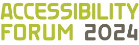{.forum-logotype alt='logo for the arXiv forum' role="presentation"}

# Welcome to the arXiv Accessibility Forum 2024!
**Exploring the many lines of action, people, and groups that are converging on more accessible science**

You are warmly invited to our second accessibility forum, an annual event for the scientific community focused on making research more accessible. The Forum is fully remote, free, and open to all. This year, we spotlight demonstrations and discussions from many different researchers and experts who are all converging on a more accessible future for science.

Learn, share, and be inspired for change. Accessibility means *access regardless of disability*, and only when research is fully accessible can we truly call it open science!

  <h2>Pre-Registration is open</h2>
  
It is time! <a href="https://cornell.ca1.qualtrics.com/jfe/form/SV_eEZ1d27LF2fVM7Y" target="_blank">Secure your spot</a> for this September and get ready to learn, share, and be inspired for change. The Forum is fully remote and free and open to all.

  <a href="https://cornell.ca1.qualtrics.com/jfe/form/SV_eEZ1d27LF2fVM7Y" target="_blank" class="button-large">Register</a>

  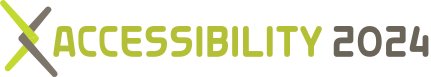
  

## Events preview
- The Social Model of disability: What are the barriers to full participation in the sciences?
- Listening to Stars: Using the technique of sonification in astronomy.
- Tactile surfaces: Using sense of touch to engage with visualizations.
- Funding accessibility: A lively discussion on the past, present, and future of funding this critical work.
- HTML papers: How arXiv and LaTeXML made it happen, and what comes next.
- [See all sessions](../event)

## Presenter affiliations
This year, we are pleased to work with presenters from these universities and other organizations, bringing diverse perspectives that converge on accessible science.

  <ul>
    <li>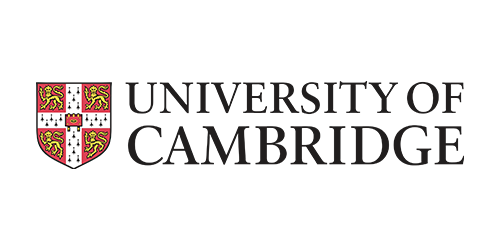University Of Cambridge</li>
    <li>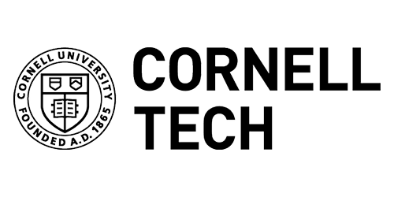 Cornell Tech</li>
    <li>EGO: European Gravitational Wave Observatory</li>
    <li>Iota School</li>
    <li>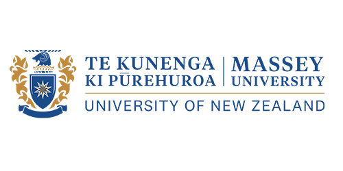Massey University</li>
    <li>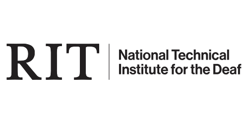RIT National Technical Institute for the Deaf</li>
    <li>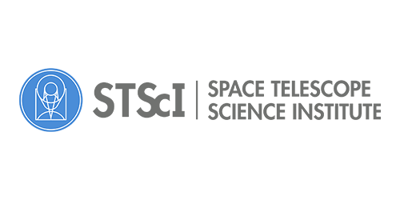Space Telescope Science Institute</li>
    <li>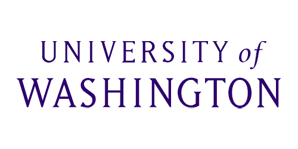University of Washington</li>
   <li> 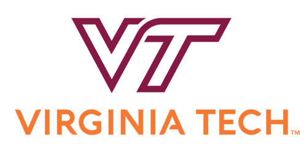Virginia Tech University</li>
   <li>Amazon</li>
   <li>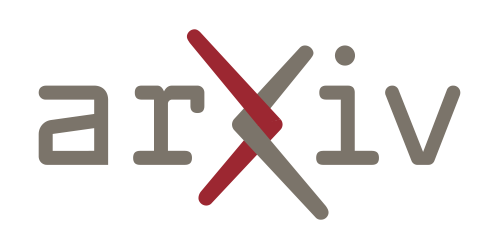arXiv</li>
   <li>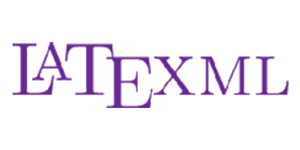LaTeXML</li>
   <li>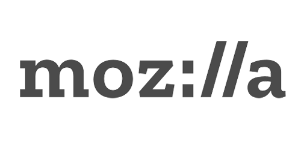Mozilla</li>
   <li>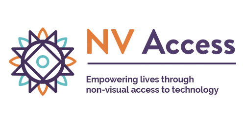NV Access</li>
   <li>Prime Access Consulting</li>
   <li>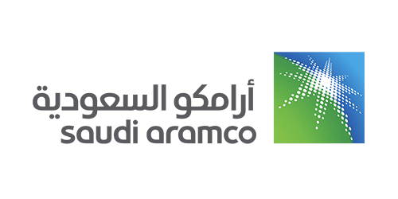Saudi Aramco</li>
   <li>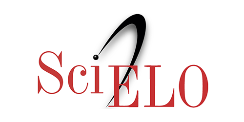SciELO</li>
  </ul>

## Catching up
- Read arXiv's [accessibility research report](
https://info.arxiv.org/about/accessibility_research_report.html){target="_blank"} that inspired this forum.
- Access [recordings from last year's forum](https://accessibility2023.arxiv.org/index.html){target="_blank"} in case you missed the event.
- Learn about the [new HTML format on arXiv](https://arxiv.org/html/2402.08954v1){target="_blank"}.

## Event Policy
- All participants must follow arXiv's [code of conduct](https://info.arxiv.org/help/policies/code_of_conduct.html#inclusiveness-and-respect){target="_blank"}.

{#no-giscus}
