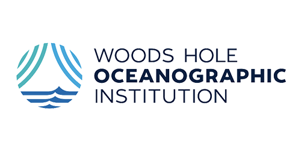

{.forum-logotype alt='logo for the arXiv forum' role="presentation"}

# Sign up for the arXiv Accessibility Forum 2024!

  

    
You are warmly invited to arXiv's second accessibility forum, a free conference for entire the scientific community focused on making research more accessible. Accessibility means *access regardless of disability*, and only when research is fully accessible can we truly call it open science.

    
The Forum is <strong>fully remote, free, and open to all.</strong> Learn, share, and engage with a diversity researchers and experts from many fields whose work is all converging on accessible science

  

  

    <h2>The 2024 Accessibility Forum playlist is growing!</h2>
    <iframe src="https://www.youtube.com/embed/videoseries?si=f32YwVHsF_Y5gGsj&amp;list=PLYgeAMJvRZ6ZRuNQGoekx0FdjXqEG0bzM" title="YouTube video player" frameborder="0" allow="accelerometer; autoplay; clipboard-write; encrypted-media; gyroscope; picture-in-picture; web-share" referrerpolicy="strict-origin-when-cross-origin" allowfullscreen></iframe>
  

  <h2>Signup is open</h2>
  
It is time! Forum sessions are free and open to all. By signing up you will receive advance access to webinar links and be emailed when recordings are available.

  <a href="https://cornell.ca1.qualtrics.com/jfe/form/SV_eEZ1d27LF2fVM7Y" target="_blank" class="button-reg">Sign up for the Forum</a>

  
  

## September Calendar

Seven individual sessions will take place on multiple days between September 3rd and 13th in 2024, featuring diverse panelists from many scientific fields.

| Mon | Tues | Wed | Thurs | Fri |
| --- | --- | --- | --- | --- |
| 2.  |  3. [Ask Me Anything](forum-session-AMA) | 4.  [AI and Accessibility](forum-session-AI) | 5. | 6. [Deaf Hub at RIT](forum-session-Deaf-Hub)  |
| 9.  | 10.  [Sonification: multi-modal science](forum-session-Sonification) | 11. [SciELO y accessibilidad / e acessibilidade](forum-session-SciELO)  | 12.  [HTML papers on arXiv](forum-session-HTML)  |  13. Keynote: [Universal Designs](forum-session-Universal-Designs) |

[View the schedule](/schedule){class="button-reg"}

## Presenter affiliations
We are pleased to be collaborating this year with presenters from these universities and other organizations, bringing diverse perspectives that all converge on more accessible science.

  <ul>
    <li>University of Barcelona</li>
    <li>University of Cambridge</li>
    <li> City University of New York</li>
    <li> Cornell Tech</li>
    <li>Gallaudet University</li>
    <li>James Madison University</li>
    <li>Massey University</li>
    <li>University of Michigan</li>
    <li>University of Oregon</li>
    <li>RIT National Technical Institute for the Deaf</li>
    <li>Federal University of São Carlos</li>
    <li>Virginia Tech</li>
   <li>arXiv</li>
   <li>Atass Sports</li>
   <li>Geneva Lake Astrophysics and STEAM Education</li>
   <li>Google</li>
   <li>Catalan Institution for Research and Advanced Studies</li>
   <li>Institute of Electrical and Electronics Engineers</li>
   <li>Journal of Cosmology and Astroparticle Physics</li>
   <li>LaTeXML</li>
   <li>Meta</li>
   <li>Mozilla</li>
   <li>NV Access</li>
   <li>Saudi Aramco</li>
   <li>Scientific Electronic Library Online</li>
   <li>Sonokids</li>
   <li>Space Telescope Science Institute</li>
   <li>Woods Hole Oceanographic Institute</li>
  </ul>

[Meet the presenters](/presenters){class="button-reg"}

## Help spread the word
[Help spread the word](share) about this event! We are all part of the effort to ensure access regardless of disability and the arXiv Forum is free and open to everyone.

## Event policy
All participants must follow arXiv's [code of conduct](https://info.arxiv.org/help/policies/code_of_conduct.html#inclusiveness-and-respect){target="_blank"}.

{#no-giscus}
