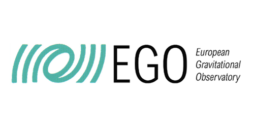

{.forum-logotype alt='logo for the arXiv forum' role="presentation"}

# Welcome to the arXiv Accessibility Forum 2024!
## Converging on accessible science together

You are warmly invited to our second accessibility forum, a free conference for the entire scientific community focused on the many people and organizations making research more accessible. Accessibility means *access regardless of disability*, and only when research is fully accessible can we truly call it open science.

The Forum is fully **remote, free, and open to all.** Learn, share, and be inspired for change.

  <h2>Registration is open</h2>
  
It is time! <a href="https://cornell.ca1.qualtrics.com/jfe/form/SV_eEZ1d27LF2fVM7Y" target="_blank">Register</a> for the Forum this September 2nd - 13th, help us gauge attendance this year, and be kept up to date as event details are finalized.

  <a href="https://cornell.ca1.qualtrics.com/jfe/form/SV_eEZ1d27LF2fVM7Y" target="_blank" class="button-large">Register for the Forum</a>

  
  

## Events preview
- The Social model of disability: What are the environmental barriers to full participation in the sciences?
- Sonification across fields and modalities
- HTML papers on arXiv: A peek under the hood with LaTeXML and NVDA.
- AI and accessibility: A demonstration of two research-based tools.
- SciELO and accessibility in South America, Spain, and beyond (held in Spanish and Portuguese)
- Deaf Hub at RIT: a resource for all of us
- Ask me anything: a lively Q&A on navigating academic ecosystems with a disability

[Learn more about the events](../event){class="button-reg"}

## Presenter affiliations
We are so pleased to work with presenters this year from these universities and other organizations, bringing diverse perspectives that all converge on accessible science.

  <ul>
    <li>University of Barcelona</li>
    <li>University of Cambridge</li>
    <li> City University of New York</li>
    <li> Cornell Tech</li>
    <li>Gallaudet University</li>
    <li>James Madison University</li>
    <li>Massey University</li>
    <li>RIT National Technical Institute for the Deaf</li>
    <li>Federal University of São Carlos</li>
    <li> Virginia Tech</li>
    <li>University of Washington</li>
   <li>arXiv</li>
   <li>Atass Sports</li>
   <!-- <li>Geneva Lake Astrophysics and STEAM (GLAS) Education</li> -->
   <li>European Gravitational Wave Observatory</li>
   <li>Google</li>
   <li>IEEE</li>
   <!-- <li>Journal of Cosmology and Astroparticle Physics</li> -->
   <li>LaTeXML</li>
   <li>Meta</li>
   <li>Mozilla</li>
   <li>NV Access</li>
   <li>Saudi Aramco</li>
   <li>SciELO</li>
   <li>Sonokids</li>
   <li>Space Telescope Science Institute</li>
  </ul>

## Catching up
- Read arXiv's [accessibility research report](
https://info.arxiv.org/about/accessibility_research_report.html){target="_blank"} that inspired this forum.
- Access [recordings from last year's forum](https://accessibility2023.arxiv.org/index.html){target="_blank"} in case you missed the event.
- Learn about the [new HTML format on arXiv](https://arxiv.org/html/2402.08954v1){target="_blank"}.

## Event policy
- All participants must follow arXiv's [code of conduct](https://info.arxiv.org/help/policies/code_of_conduct.html#inclusiveness-and-respect){target="_blank"}.

{#no-giscus}
