# Presenter bios

{.forum-logotype alt='logo for the arXiv forum' role="presentation"}
We are very pleased to be working with the following key participants to bring this forum to life. The bios are listed in the alphabetical order of last names.

### Arwa Alnajashi
<!-- {.mkd-img-left .mkd-img-20 .mkd-img-margin alt='Arwa Alnajashi Photo'} -->
Data Scientist, Saudi Aramco.

Arwa applies leading data science techniques to automate critical operations within the oil and gas industry. Her passion lies in creating an empowered and inclusive digital future, ensuring that advancements in technology pave the way for greater accessibility and efficiency across industries. [Arwa's LinkedIn Page](https://sa.linkedin.com/in/arwa-alnajashi-84b1541a2?trk=people-guest_people_search-card){target="_blank"}

### Sina Bahram
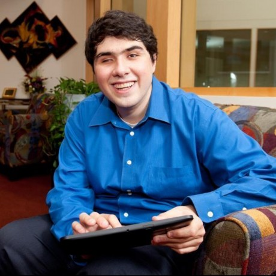{.mkd-img-left .mkd-img-20 .mkd-img-margin alt='Sina Bahram Photo'}
Founder of Prime Access Computing

Lorem ipsum dolor sit amet, consectetur adipiscing elit, sed do eiusmod tempor incididunt ut labore et dolore magna aliqua. Ut enim ad minim veniam, quis nostrud exercitation ullamco laboris nisi ut aliquip ex ea commodo consequat. Duis aute irure dolor in reprehenderit in voluptate velit esse cillum dolore eu fugiat nulla pariatur. Excepteur sint occaecat cupidatat non proident, sunt in culpa qui officia deserunt mollit anim id est laborum.

### Shamsi Brinn
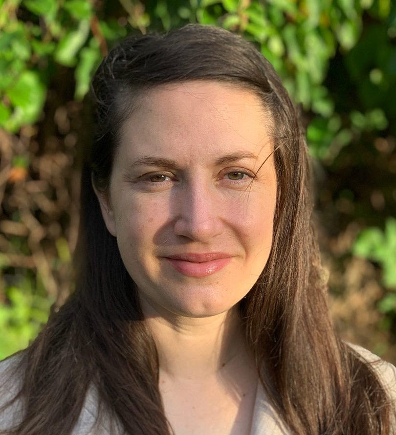{.mkd-img-left .mkd-img-20 .mkd-img-margin alt='Shamsi Brinn Photo'}
UX Manager, arXiv. 

To advance accessibility at arXiv, Shamsi brings the experiences of researchers with disabilities to the forefront of organizational planning, and championed the research, analysis, and production of arXiv's [Dec. 2022 report on accessibility](https://info.arxiv.org/about/accessibility_research_report.html). She has also had the pleasure of organizing this forum and working with each of the wonderful participants above to bring it to life. Thank you for joining us! [Shamsi's LinkedIn Profile](https://www.linkedin.com/in/shamsi-brinn/){target="_blank"}

### Kim Bryant
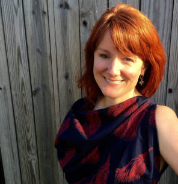{.mkd-img-left .mkd-img-20 .mkd-img-margin alt='Kim Bryant Photo'}
Senior Staff Product Manager - Accessibility, Mozilla.

Lorem ipsum dolor sit amet, consectetur adipiscing elit, sed do eiusmod tempor incididunt ut labore et dolore magna aliqua. Ut enim ad minim veniam, quis nostrud exercitation ullamco laboris nisi ut aliquip ex ea commodo consequat. Duis aute irure dolor in reprehenderit in voluptate velit esse cillum dolore eu fugiat nulla pariatur. Excepteur sint occaecat cupidatat non proident, sunt in culpa qui officia deserunt mollit anim id est laborum. [Kim's LinkedIn](https://www.linkedin.com/in/kimbryant/){target="_blank"}

### Michael Curran
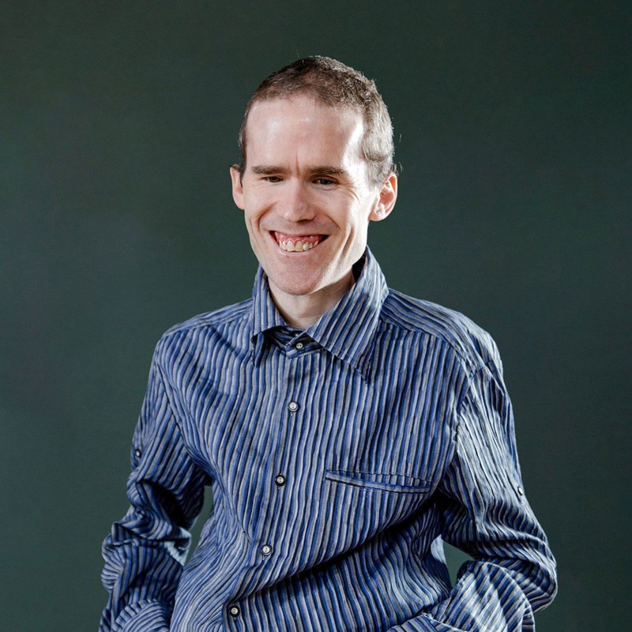{.mkd-img-left .mkd-img-20 .mkd-img-margin alt='Michael Curran Photo'}
Co-Founder and Lead Developer, NV Access Limited (NVDA).

Mick is the creator of the free and open source NVDA screen reading software, enabling more than 200,000 blind and vision impaired people worldwide to independently use computers. His expertise lies in software accessibility standards, software APIs, and best practice approaches to functional usability. [Mick's LinkedIn Profile](https://au.linkedin.com/in/mdcurran){target="_blank"}

### Dr. Wanda Diaz-Merced
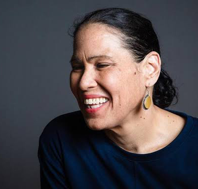{.mkd-img-left .mkd-img-20 .mkd-img-margin alt='Wanda Diaz-Merced Photo'}
Program Lead, European Gravitational Wave Observatory; Director, Arecibo Observatory.

Wanda is an astronomer and the developer of the technique, sonification, that converts astrophysical data into audible sound. As someone who lost her eyesight since teenage years, she is a leader in increasing equality of access to astronomy. [Wanda's Profile](){target="_blank"}

### Hannah DeFelice
<!-- {.mkd-img-left .mkd-img-20 .mkd-img-margin alt='Hannah DeFelice Photo'} -->
Master's Student in Environmental Science, Rochester Institute of Technology.

TBD: Hannah is a blinddeaf environmental science researcher. She is currently working on the NSF-funded Multiscale RECIPES Project for Sustainable Food System.

### Dr. Solange Maria dos Santos
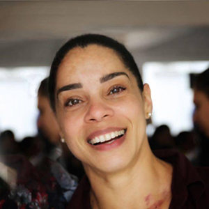{.mkd-img-left .mkd-img-20 .mkd-img-margin alt='Solange dos Santos Photo'}
Online Submission & Preprints Coordinator, SciELO.

Solange brings in scientific communication expertise in diverse geographical contexts, such as Argentina, Bolivia, Colombia, Mexico, Paraguay, and South Africa Solange advocates for accessibility in both the open archive and various academic journals. [Solange's LinkedIn Profile](https://www.linkedin.com/in/solangemariasantos/?originalSubdomain=br){target="_blank"}

### Dr. Scott Fleming
{.mkd-img-left .mkd-img-20 .mkd-img-margin alt='Scott Fleming Photo'}
Archive Scientist at the Mikulski Archive for Space Telescopes (MAST), Space Telescope Science Institute (STSI). 

Scott supports missions like GALEX, Kepler, K2, and TESS, spectroscopic data sets across the entire MAST archive. Research-wise, he is interested in open source software development, and new science that is enabled with archival or cross-mission data. [Scott's STSI Profile](https://www.stsci.edu/stsci-research/research-directory/scott-fleming){target="_blank"}

### Deyan Ginev
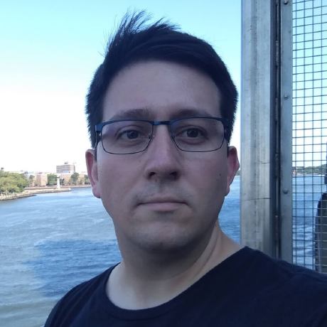{.mkd-img-left .mkd-img-20 .mkd-img-margin alt='Deyan Ginev Photo'}
Creator of ar5iv.org and LaTeXML Developer; W3C Math Working Group Member; Ph.D. candidate in hiding (do not disturb).

Deyan's main focus is to enhance the representation of mathematical expressions in rendered research papers, improving their accessibility, computational semantics, and enabling further reuse in a broader class of applications. [Deyan's University Profile](https://kwarc.info/people/dginev/){target="_blank"}

### Dr. Jonathan Godfrey
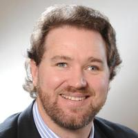{.mkd-img-left .mkd-img-20 .mkd-img-margin alt='Jonathan Godfrey Photo'}
Senior Lecturer in Statistics, School of Mathematical and Computational Sciences, Massey University.

Jonathan's research is focused on the needs of the thousands of blind people around the world who need additional tools to make the visual elements of statistical thinking and practice less of a barrier. [Jonathan's Faculty Profile](https://www.massey.ac.nz/massey/expertise/profile.cfm?stref=416430){target="_blank"}

### Ricardo Enrique Gonzalez
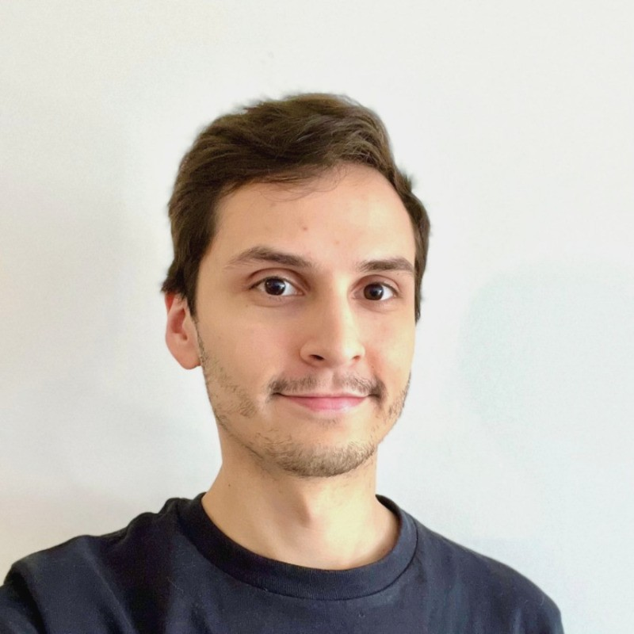{.mkd-img-left .mkd-img-20 .mkd-img-margin alt='Ricardo Gonzalez Photo'}
Ph.D. Candidate in Information Science, Cornell Tech.

Ricardo designs interactive systems that empower people of disabilities, particularly Blind and Low Vision users, in 3D virtual environments, data analysis, AI powered systems, and mobile cameras. [Ricardo's Homepage](https://rgonzalezp.github.io/){target="_blank"}

### Sarah Kane
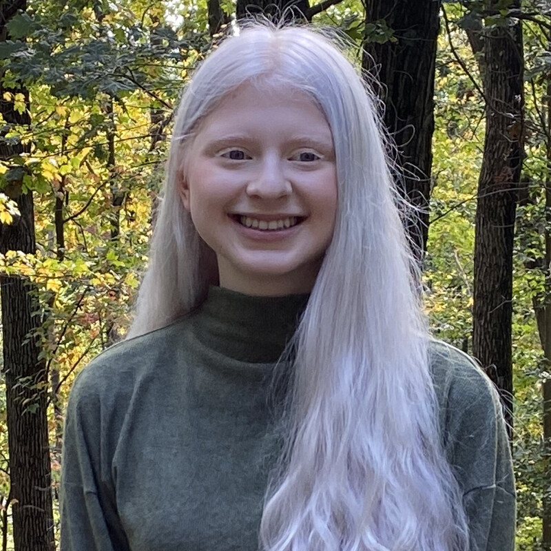{.mkd-img-left .mkd-img-20 .mkd-img-margin alt='Sarah Kane Photo'}
Ph.D. Candidate in Astrophysics, Institute of Astronomy, Univeristy of Cambridge.

For Sarah, her career as a researcher is intertwined with her work as a disability advocate. She was born legally blind and has a strong interest in the accessibility of science to people with disabilities. Her work includes usability testing for Astronify, a project of the Space Telescope Institute turning datasets into audio. [Sarah's LinkedIn Profile](https://uk.linkedin.com/in/sarah-kane-4a9414220){target="_blank"}

### Tony Malykh
<!-- 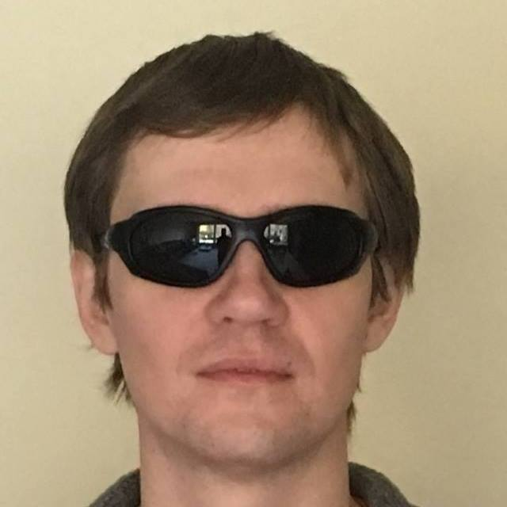{.mkd-img-left .mkd-img-20 .mkd-img-margin alt='Tony Malykh Photo'} -->
Software Engineer, Meta.

Lorem ipsum dolor sit amet, consectetur adipiscing elit, sed do eiusmod tempor incididunt ut labore et dolore magna aliqua. Ut enim ad minim veniam, quis nostrud exercitation ullamco laboris nisi ut aliquip ex ea commodo consequat.

### Alex Mendonça
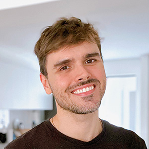{.mkd-img-left .mkd-img-20 .mkd-img-margin alt='Alex Mendonça Photo'}
Production and Publishing Coordinator, SciELO.

During Alex's 17-year tenure at SciELO, he has co-led several significant strategies, including the transition from indexed journals to Open Science, as well as the implementation of Diversity, Equity, Inclusion and Accessibility (DEIA) policies. [Alex's LinkedIn Profile](https://www.linkedin.com/in/alex-mendon%C3%A7a/?originalSubdomain=br){target="_blank"}

### Joshua Miele 
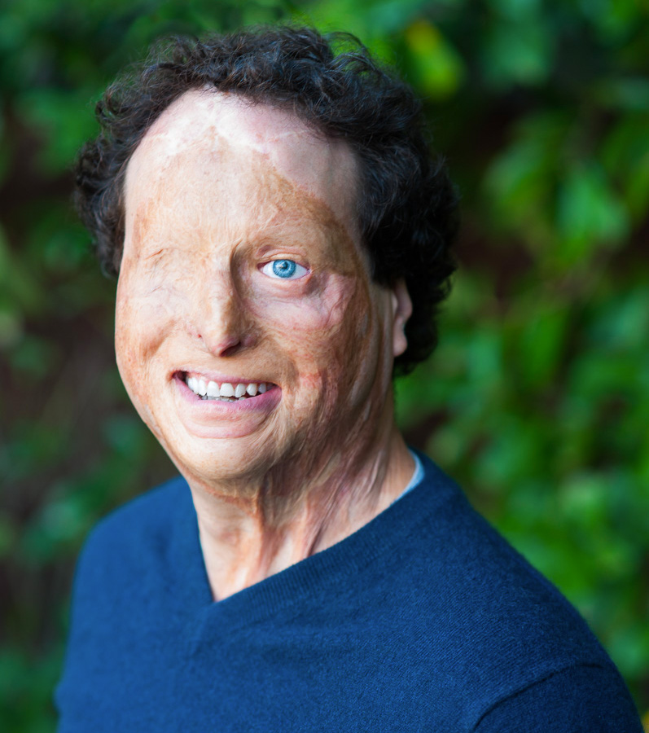{.mkd-img-left .mkd-img-20 .mkd-img-margin alt='Joshua Miele Photo'}
Principal Accessibility Researcher, Amazon Lab126; 2021 MacArthur Foundation Fellow.

Lorem ipsum dolor sit amet, consectetur adipiscing elit, sed do eiusmod tempor incididunt ut labore et dolore magna aliqua. Ut enim ad minim veniam, quis nostrud exercitation ullamco laboris nisi ut aliquip ex ea commodo consequat. Duis aute irure dolor in reprehenderit in voluptate velit esse cillum dolore eu fugiat nulla pariatur. Excepteur sint occaecat cupidatat non proident, sunt in culpa qui officia deserunt mollit anim id est laborum.

### Camille Ouellette 
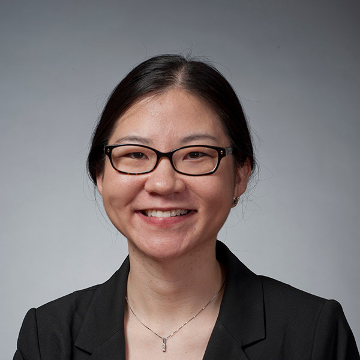{.mkd-img-left .mkd-img-20 .mkd-img-margin alt='Camille Ouellette Photo'}
Senior Lecturer in Biology and Deaf Hub Affliate, Rochester Institute of Technology.

Lorem ipsum dolor sit amet, consectetur adipiscing elit, sed do eiusmod tempor incididunt ut labore et dolore magna aliqua. Ut enim ad minim veniam, quis nostrud exercitation ullamco laboris nisi ut aliquip ex ea commodo consequat. Duis aute irure dolor in reprehenderit in voluptate velit esse cillum dolore eu fugiat nulla pariatur. Excepteur sint occaecat cupidatat non proident, sunt in culpa qui officia deserunt mollit anim id est laborum. [Camille's Faculty Profile](https://www.rit.edu/directory/ceonts-camille-ouellette){target="_blank"}

### Venkatesh Potluri
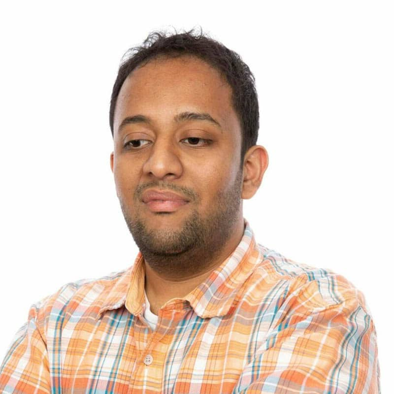{.mkd-img-left .mkd-img-20 .mkd-img-margin alt='Venkatesh Potluri Photo'}
Ph.D. Candidate in Computer Science and Engineering, University of Washington.

Venkatesh examines accessibility barriers experienced by blind or visually impaired (BVI) developers participating in professional programming domains such as user interface design, data science, and physical computing. His work contributes real-world systems to improve developer tools and new interaction techniques. [Venkatesh's Homepage](https://venkateshpotluri.me/){target="_blank"}

### Norbert Preining
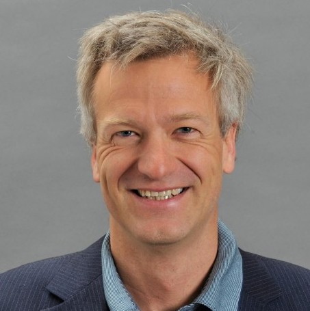{.mkd-img-left .mkd-img-20 .mkd-img-margin alt='Norbert Preining Photo'}

Lorem ipsum dolor sit amet, consectetur adipiscing elit, sed do eiusmod tempor incididunt ut labore et dolore magna aliqua. Ut enim ad minim veniam, quis nostrud exercitation ullamco laboris nisi ut aliquip ex ea commodo consequat. Duis aute irure dolor in reprehenderit in voluptate velit esse cillum dolore eu fugiat nulla pariatur. Excepteur sint occaecat cupidatat non proident, sunt in culpa qui officia deserunt mollit anim id est laborum.

### Dr. Thijs Jan Roumen
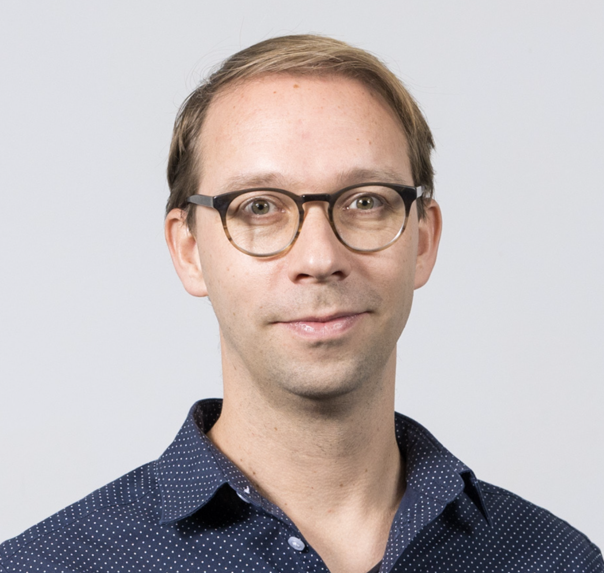{.mkd-img-left .mkd-img-20 .mkd-img-margin alt='Thijs Roumen Photo'}
Assistant Professor of Information Science and Matter of Tech Lab, Cornell Tech.

Thijs' research focus is digital fabrication, a nascent subfield of human-computer interaction (HCI). He aims to create a technological basis that allows designers and engineers to build on each other's work and enable personal fabrication relevant to everyone as opposed to the industrialists and hobbyists. [Thijs's Homepage](http://thijsroumen.eu/)

### Dr. Ashley Shew
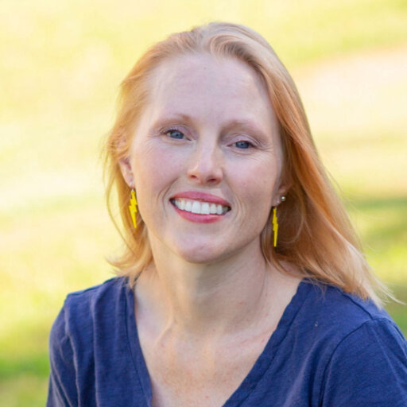{.mkd-img-left .mkd-img-20 .mkd-img-margin alt='Ashley Shew Photo'}
Associate Professor of Science, Technology, and Society, Virginia Tech.

Ashley specializes in disability studies and technology ethics. She is the author of several critically acclaimed books, including Against Technoableism, Animal Constructions, and Technological Knowledge and Spaces for the Future (coedited). [Ashley's Faculty Page](https://liberalarts.vt.edu/departments-and-schools/department-of-science-technology-and-society/faculty/ashley-shew.html){target="_blank"}

### Dr. Patrick Smyth
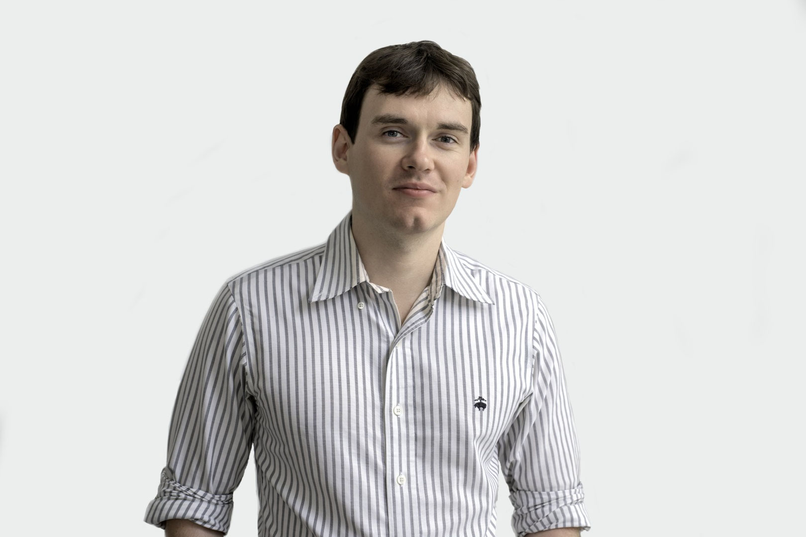{.mkd-img-left .mkd-img-20 .mkd-img-margin alt='Patrick Smyth Photo'}
Chief Learner, Iota School; Staff Developer Relations Engineer, Chainguard.

Patrick is a blind hacker and programmer whose work focuses on citizen technology, critical infrastructure, accessibility, and technical pedagogy. [Patrick's Homepage](https://smythp.com/index.html){target="_blank"}

{#no-giscus}