# Presenter bios

We are very pleased to be working with the following participants to bring this forum to life. The bios are listed in the alphabetical order of last name.

### Arwa Alnajashi

<!-- {.mkd-img-left .mkd-img-profile alt='Arwa Alnajashi Photo'} -->

Data Scientist, Saudi Aramco.

Arwa's passion lies in creating an empowered and inclusive digital future, ensuring that advancements in technology pave the way for greater accessibility and efficiency across industries. Currently, she applies data science to automate critical operations in the oil and gas industry. [Arwa's LinkedIn Page](https://sa.linkedin.com/in/arwa-alnajashi-84b1541a2?trk=people-guest_people_search-card){target="_blank"}

---

### Elizabeth Ayers 

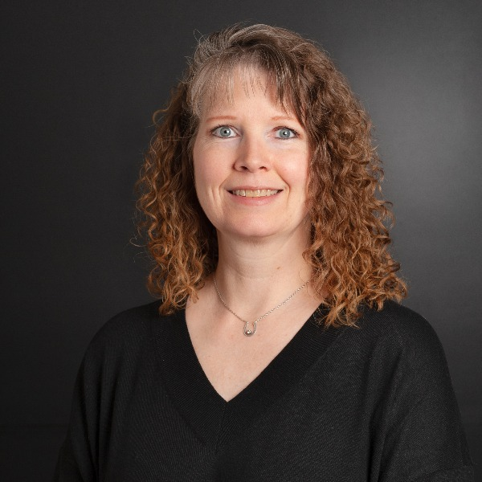{.mkd-img-left .mkd-img-profile alt='Headshot of Liz Ayers in a black shirt against a dark grey background'}

Senior Lecturer, Department of Science and Mathematics and Director of Healthcare Mentoring, Deaf Healthcare and Biomedical Sciences Hub (Deaf Hub), National Technical Institute for the Deaf at Rochester Institute of Technology.

Liz is a sonographer at Highland Hospital and science instructor at NTID/RIT teaching science to deaf and hard of hearing undergraduate students. She runs the Mentor Supported Shadowing Program at Deaf Hub. In addition, Liz is a current University at Buffalo doctoral student almost at dissertation. [Liz's RIT Profile](https://www.rit.edu/directory/ewants-elizabeth-ayers){target="_blank"}

---

### Kim Bryant

{.mkd-img-left .mkd-img-profile alt='Headshot of Kim Bryant against a wooden wall'}

Senior Staff Product Manager in Accessibility, Mozilla; Co-Founder of Disability@Mozilla, an internal employee resource group.

Kim brings expertise in interprating accessibility through the lens of social sciences and empowering people of disabilities by giving them customizable accessibility toolboxes. [Kim's LinkedIn](https://www.linkedin.com/in/kimbryant/){target="_blank"}

---

### Michael Curran

{.mkd-img-left .mkd-img-profile alt='Headshot of Michael Curran against a dark neutral background'}

Co-Founder and Lead Developer, NV Access Limited (NVDA).

Mick is the creator of the free and open source NVDA screen reading software, that has enabled more than 200,000 blind and vision impaired people worldwide to independently use computers. He brings expertise in software accessibility standards, software APIs, and best practice approaches to functional usability. [Mick's LinkedIn Profile](https://au.linkedin.com/in/mdcurran){target="_blank"}

---

### Phia Damsma 

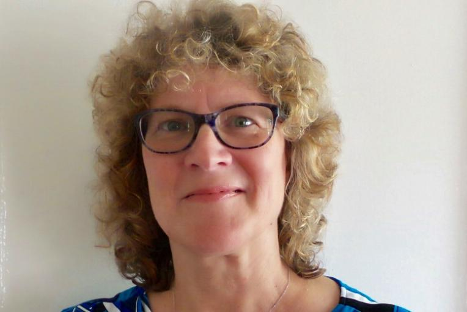{.mkd-img-left .mkd-img-profile alt='Headshot of Phia Damsma in black glasses against a white background'}

Creative Director, Sonokids Australia

Phia has more than 25 years of experience building innovative educational software programs and mobile apps for children with special needs, especially blind and low-vision. Her not-for-profit social enterprise Sonokids is impacting children globally, supporting playful learning of fundamental technology and other Expanded Core Curriculum skills, through the technique of sonification. [Phia's LinkedIn Profile](https://au.linkedin.com/in/phia-damsma-18b3a29){target="_blank"}

---

### Dr. Wanda Diaz-Merced

{.mkd-img-left .mkd-img-profile alt='Photo of Wanda Diaz-Merced presenting on the stage with a microphone'}

Program Lead, European Gravitational Wave Observatory; Director, Arecibo Observatory.

Wanda is an astronomer and the developer of the technique, sonification, that converts astrophysical data into audible sound. As someone who lost her eyesight since teenage years, she is a leader in increasing equality of access to astronomy. [Wanda's Profile](){target="_blank"}

---

### Hannah DeFelice

<!-- {.mkd-img-left .mkd-img-profile alt='Hannah DeFelice Photo'} -->

Master's Student in Environmental Science, Rochester Institute of Technology.

Hannah’s research focuses on permaculture, especially carbon cycles and their impact. [Hannah's Profile](){target="_blank"}

---

### Dr. Solange Maria dos Santos

{.mkd-img-left .mkd-img-profile alt='Candid photo of Solange dos Santos smiling in a crowd'}

Production and Publishing Coordinator, SciELO. 

Solange brings in scientific communication expertise in diverse geographical contexts, such as Argentina, Bolivia, Colombia, Mexico, Paraguay, and South Africa. Solange is a strong advocate for accessibility in open archive space as well as academic journals. [Solange's LinkedIn Profile](https://www.linkedin.com/in/solangemariasantos/?originalSubdomain=br){target="_blank"}

---

### Dr. Scott Fleming

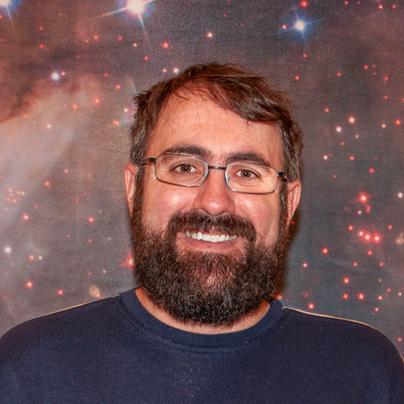{.mkd-img-left .mkd-img-profile alt='Headshot of Scott Fleming in a Boston Red Sox cap smiling against a grey background'}

Archive Scientist at the Mikulski Archive for Space Telescopes (MAST), Space Telescope Science Institute (STSI). 

Scott studies stars and exoplanets in the ultraviolet, optical, and infrared. He is one of the movers and shakers behind Astronify, an open source sonification tool written in Python and used for analyzing data from NASA’s space telescopes. [Scott's STSI Profile](https://www.stsci.edu/stsci-research/research-directory/scott-fleming){target="_blank"}

---

### Deyan Ginev

{.mkd-img-left .mkd-img-profile alt='Headshot of Deyan Ginev outdoors with a river in the background'}

Creator of ar5iv.org and LaTeXML Developer; W3C Math Working Group Member; Ph.D. candidate in hiding (do not disturb).

Deyan's main focus is to enhance the representation of mathematical expressions in rendered research papers, improving their accessibility, computational semantics, and enabling further reuse in a broader class of applications. [Deyan's University Profile](https://kwarc.info/people/dginev/){target="_blank"}

---

### Dr. Jonathan Godfrey
{.mkd-img-left .mkd-img-profile alt='Headshot of Jonathan Godfrey smiling in a suit'}

Senior Lecturer in Statistics, School of Mathematical and Computational Sciences, Massey University.

Jonathan's research is focused on the needs of the thousands of blind people around the world who need additional tools to make the visual elements of statistical thinking and practice less of a barrier. [Jonathan's Faculty Profile](https://www.massey.ac.nz/massey/expertise/profile.cfm?stref=416430){target="_blank"}

---

### Ricardo Enrique Gonzalez
{.mkd-img-left .mkd-img-profile alt='Headshot of Ricardo Gonzalez against a clear grey background'}

Ph.D. Candidate in Information Science, Cornell Tech.

Ricardo designs interactive systems that empower people of disabilities, particularly Blind and Low Vision users, in 3D virtual environments, data analysis, AI powered systems, and mobile cameras. [Ricardo's Homepage](https://rgonzalezp.github.io/){target="_blank"}

---

### Dr. Mar Gonzalez-Franco
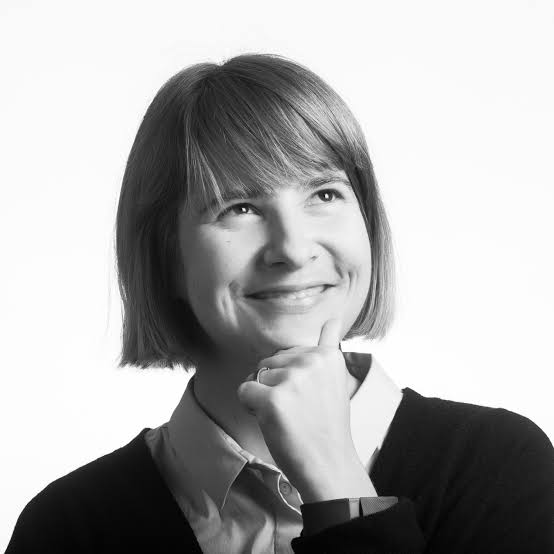{.mkd-img-left .mkd-img-profile alt='Black and white headshot of Mar Gonzalez smiling and looking into the top right corner while holding her chin'}

Editor and Ethics and Diversity Chair, IEEE VGTC; Research Scientist, Google

Mar is a Computer Scientist and Neuroscientist working on a new generation of Immersive technologies and generative AI. To the forum, she brings in 4 years of expertise as the Ethics and Diversity Chair of IEEE VGTC, where she has forwarded accessibility standards and regional diversity significantly. [Mar's Homepage](https://margonzalezfranco.github.io/){target="_blank"}

---

### Dr. Bonnie Jacob
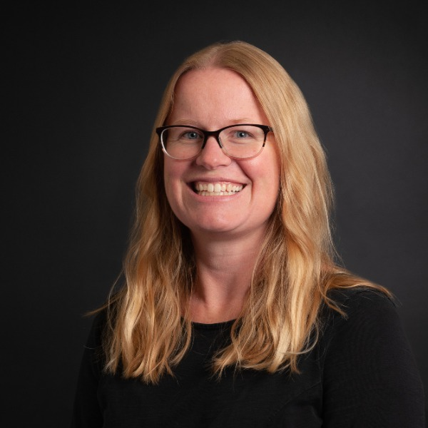{.mkd-img-left .mkd-img-profile alt='Headshot of Bonnie Jacob against a clear dark grey background'}

Associate Professor, Department of Science and Mathematics and National Technical Institute for the Deaf, Rochester Institute of Technology.

Bonnie is passionate about promoting undergraduate research in mathematics as well as STEM in general, particularly among deaf and hard-of-hearing students. She is a mathematician by training, specializing in graph theory and combinatorial matrix theory. [Bonnie's RIT Profile](https://www.rit.edu/directory/bcjntm-bonnie-jacob){target="_blank"}

---

### Sarah Kane

{.mkd-img-left .mkd-img-profile alt='Headshot of Sarah Kane smiling in a forest'}

Ph.D. Candidate in Astrophysics, Institute of Astronomy, University of Cambridge.

For Sarah, her career as a researcher is intertwined with her work as a disability advocate. She was born legally blind and has a strong interest in the accessibility of science to people with disabilities. Her work includes usability testing for Astronify, a project of the Space Telescope Institute turning datasets into audio. [Sarah's LinkedIn Profile](https://uk.linkedin.com/in/sarah-kane-4a9414220){target="_blank"}

---

### Devva Kasnitz
{.mkd-img-left .mkd-img-profile alt='Headshot of Devva Kasnitz in a red sweater and a red scarf against a white background'}

Executive Director of the Society for Disability Studies and Adjunct Professor, CUNY.

TBD. [Devva's Profile](){target="_blank"}

---

### Dyl Levenson

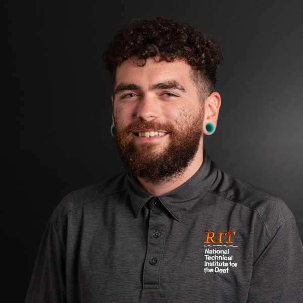{.mkd-img-left .mkd-img-profile alt='Headshot of Dyl Levenson in a dark grey RIT polo against a dark grey background'}

Biomedical Science Training Grants Admin, National Technical Institute for the Deaf, Rochester Institute of Technology.

Dyl is the coordinator for undergraduate and graduate research training programs in the biomedical, biobehavioral, and clinical fields at Deaf Hub. He is also a grad student in health health systems management. [Dyl’s RIT Profile](https://www.rit.edu/directory/djldhb-dyl-levenson){target="_blank"}

---

### Anne Kearney Logan

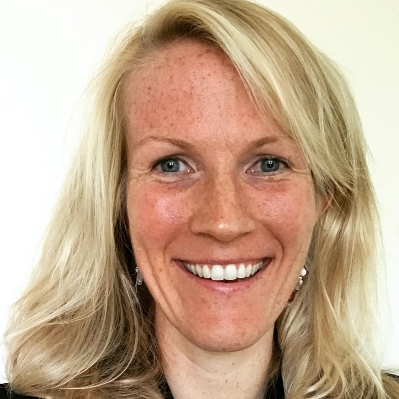{.mkd-img-left .mkd-img-profile alt='Headshot of Anne Logan smiling against a white background'}

Adjunct Professor, Gallaudet University

A rejoiner from last year's forum, Anne currently teaches as an adjunct professor at Gallaudet and creates STEM videos for deaf/HOH children for educational game app company ASL Aspire. She soon will launch her own wine education program in ASL. She will share with us on her recent transition from graduating from a PhD in horticulture with a speciality in viticulture from Cornell to being a professor in the accessible research ecosystem event. [Anne's LinkedIn Profile](https://www.linkedin.com/in/anne-k-logan-9a75b989?miniProfileUrn=urn%3Ali%3Afs_miniProfile%3AACoAABLGyU8B6fMg89OiVzRHqYwox-tM9nmyMOA&lipi=urn%3Ali%3Apage%3Ad_flagship3_search_srp_all%3BOYiGkKY3QdChWt3SKi%2FFEw%3D%3D){target="_blank"}

---

### Luisa de Souza Leão  

Master's Student in Special Education, Federal University of São Carlos (UFSCar). 

A psychologist by training, Luisa brings in expertise at the intersection of psychology, education and accessibility. Outside of her research career, she is a member of the Permanent Accessibility and Inclusion Committee of the Regional Labor Court of the 8th Region in Brazil. [Luisa's Profile](){target="_blank"}

---

### Tony Malykh

<!-- {.mkd-img-left .mkd-img-profile alt='Head of Tony Malykh'} -->
Software Engineer, Meta.

Tony is a machine learning scientist, a long-time supporter of arXiv, and a contributor to NVDA's open source codebase. [Tony's Profile](){target="_blank"}

---
### Carmody McCalley

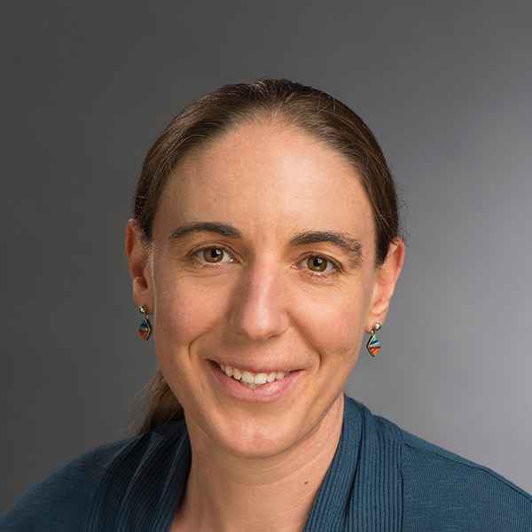{.mkd-img-left .mkd-img-profile alt='Headshot of Carmody McCalley in a blue blazor smiling against a grey background'}

Associate Professor in Life Sciences and Director of Environmental Science MS Program, Rochester Institute of Technology.

Carmody brings expertise in working with students with accessibility needs in and oustide of the classroom setting and supporting their research career as a professor. [Carmody's Faculty Profile](https://www.rit.edu/directory/ckmsbi-carmody-mccalley){target="_blank"}

---

### Alex Mendonça

{.mkd-img-left .mkd-img-profile alt='Headshot of Alex Mendonça smiling in an indoor environment'}

Online Submission & Preprints Coordinator, SciELO.

Alex brings expertise in organizational strategies in transitioning from indexed journals to open science, as well as the implementation of Diversity, Equity, Inclusion and Accessibility (DEIA) policies at SciELO. [Alex's LinkedIn Profile](https://www.linkedin.com/in/alex-mendon%C3%A7a/?originalSubdomain=br){target="_blank"}

---

### Kate Meredith

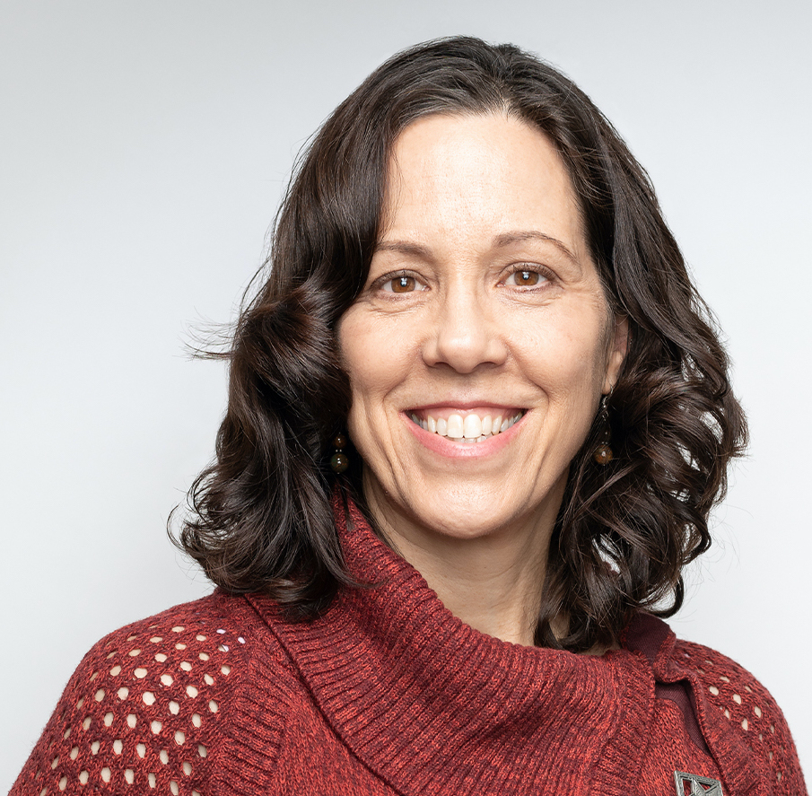{.mkd-img-left .mkd-img-profile alt='Headshot of Kate Meredith in a red sweater smiling against a grey background'}

Founder and President, Geneva Lake Astrophysics and STEAM (GLAS) Education.

Kate is committed to ensuring that all who want the opportunity to pursue careers in STEAM have the chance to do so, with a clear focus on accessibility and multigenerational engagement. Some of her projects at GLAS include creating accessible curricula and data analysis softwares, and hosting summer intern programs and public star parties. [Kate's LinkedIn Profile](https://www.linkedin.com/in/kmeredith){target="_blank"}

---

### Camille Ouellette 

{.mkd-img-left .mkd-img-profile alt='Headshot of Camille Ouellette in a suit against a clear grey background'}

Senior Lecturer in Biology and Deaf Hub Affliate, Rochester Institute of Technology.

Camille brings expertise in supporting deaf and hard of hearing (DHH) researchers throughout their academic career, and empowers their development by providing and connecting them to the right resources they need. [Camille's RIT Profile](https://www.rit.edu/directory/ceonts-camille-ouellette){target="_blank"}

---

### Venkatesh Potluri

{.mkd-img-left .mkd-img-profile alt='Headshot of Venkatesh Potluri against a white background'}

Ph.D. Candidate in Computer Science and Engineering, University of Washington.

Venkatesh examines accessibility barriers experienced by blind or visually impaired (BVI) developers participating in professional programming domains such as user interface design, data science, and physical computing. His work contributes real-world systems to improve developer tools and new interaction techniques. [Venkatesh's Homepage](https://venkateshpotluri.me/){target="_blank"}

---

### Norbert Preining

{.mkd-img-left .mkd-img-profile alt='Headshot of Norbert Preining smiling against a grey background'}

Principal Software Engineer, arXiv.

As the author of TeXLive, Norbert brings leading expertise in TeX and LaTeX. [Norbert's Homepage](https://www.preining.info/){target="_blank"}

---

### Dr. Thijs Jan Roumen

{.mkd-img-left .mkd-img-profile alt='Headshot of Thijs Roumen against a grey background'}

Assistant Professor of Information Science and Matter of Tech Lab, Cornell Tech.

Thijs' research focus is digital fabrication, a nascent subfield of human-computer interaction (HCI). He aims to create a technological basis that allows designers and engineers to build on each other's work and enable personal fabrication relevant to everyone as opposed to the industrialists and hobbyists. [Thijs's Homepage](http://thijsroumen.eu/){target="_blank"}

---
### Dr. Ashley Shew

{.mkd-img-left .mkd-img-profile alt='Headshot of Ashley Shew smiling outdoors on a lawn'}

Associate Professor of Science, Technology, and Society, Virginia Tech.

Ashley specializes in disability studies and technology ethics. She is the author of several critically acclaimed books, including Against Technoableism, Animal Constructions, and Technological Knowledge and Spaces for the Future (coedited). [Ashley's Faculty Page](https://liberalarts.vt.edu/departments-and-schools/department-of-science-technology-and-society/faculty/ashley-shew.html){target="_blank"}

---

### Jenna Stewardson 	

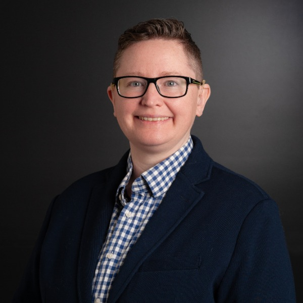{.mkd-img-left .mkd-img-profile alt='Headshot of Jenna Stewardson smiling in a blue and white checkered shirt and a navy blazer against a dark grey background'}

Research Program Coordinator, National Technical Institute for the Deaf, Rochester Institute of Technology.

Jenna is the research coordinator extraordinaire at Deaf Hub. [Jenna’s RIT Profile](https://www.rit.edu/directory/jasccl-jenna-stewardson){target="_blank"}

---

### Robin Williams
Data analyst, Atass Sports.

Robin completed his PhD in statistical methods for weather forecasting, before moving to industry where he works as a research statistician in sports prediction. During his PhD he helped to develop the sonify R package, which he uses regularly to convert 2D data in to sound. He also has an interest in anything that helps to make STEM subjects more accessible to visually impaired people. [Robin’s R Package Page](https://cran.r-project.org/web/packages/sonify/index.html){target="_blank"}

---

### Dr. Licia Verde
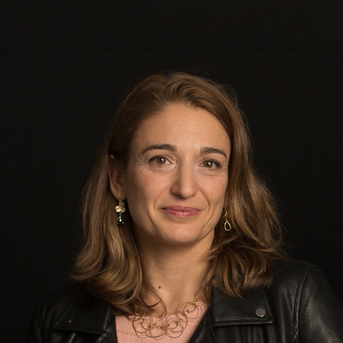{.mkd-img-left .mkd-img-profile alt='Headshot of Licia Verde against a dark background'}

Scientific Director at Journal of Cosmology and Astroparticle Physics; ICREA Professor at the Institute of Cosmo Sciences, University of Barcelona.

Licia brings in intersectional expertise in accessible science as an author, researcher, and editor. Licia is also a long-time friend of arXiv as she serves as the chair of the science advisory board since 2019. [Licia's Faculty Page](https://liciaverde.icc.ub.edu/){target="_blank"}

---
### Dr. Raafat Mahmoud Zaini
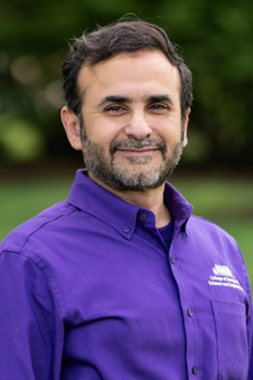{.mkd-img-left .mkd-img-profile alt='Headshot of Raafat Zaini in a purple shirt against a background of greenery'}

Assistant Professor, College of Integrated Science and Engineering, James Madison University.

Raafat specializes in modeling dynamic systems, with a research focus that encompasses organizational design, dissent, change, strategy, cognitive learning, higher education, and human systems. Bringing a wealth of practical experience to his academic pursuits, Raafat teaches systems thinking, creative problem solving, and designing future-forward organizations. Most recently, he has been passionate about harnessing generative AI to improve accessibility for the visually impaired and neurodiverse learners. [Raafat's Faculty Page](https://www.jmu.edu/cise/people/faculty/zaini-raafat.shtml){target="_blank"}

---

### Allie Zombron
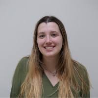{.mkd-img-left .mkd-img-profile alt='Headshot of Allie Zombron smiling in a green sweater in a classroom setting'}

Third-year undergraduate student, James Madison Univeristy

Allie's research focuses on using AI in system thinking to drive inclusivity in STEM Education for the Visually Impaired. She brings in her project that uses AI to explain, interpret and verbalize content in images for visually impaired users in the form of a flow chart, a typical presentation choice in system thinking. [Allie's LinkedIn Page](https://www.linkedin.com/in/allie-zombron-87394a290/){target="_blank"}

 

# Facilitator bio
### Shamsi Brinn
{.mkd-img-left .mkd-img-profile alt='Headshot of Shamsi Brinn against a greenery'}

UX Manager, arXiv. 

To advance accessibility at arXiv, Shamsi brings the experiences of researchers with disabilities to the forefront of organizational planning, and championed the research, analysis, and production of arXiv's [Dec. 2022 report on accessibility](https://info.arxiv.org/about/accessibility_research_report.html). She has also had the pleasure of organizing this forum and working with each of the wonderful participants above to bring it to life. Thank you for joining us! [Shamsi's LinkedIn Profile](https://www.linkedin.com/in/shamsi-brinn/){target="_blank"}

{#no-giscus}

<!-- ---

### Joshua Miele 

{.mkd-img-left .mkd-img-profile alt='Headshot of Joshua Miele smiling against a greenery'}

Principal Accessibility Researcher, Amazon Lab126; 2021 MacArthur Foundation Fellow.

Josh specializes in accessible technology design with previous research projects on tactile graphics and auditory displays. Additionally, he is an expert in effective giving and philanthropy in the accessible science space. 

---

### Sina Bahram

{.mkd-img-left .mkd-img-profile alt='Headshot of Sina Bahram sitting  on a sofa holding an iPad'}

Founder, Prime Access Computing.

Sina is a blind computer scientist, consultant, entrepreneur, and researcher. He brings expertise in inclusive design  in an operationally scalable and sustainable manner, be it a website, a mix-reality experience, or an entire museum.

---

### Dr. Patrick Smyth

{.mkd-img-left .mkd-img-profile alt='Headshot of Patrick Smyth against a clear grey background'}

Chief Learner, Iota School; Staff Developer Relations Engineer, Chainguard.

Patrick is a blind hacker and programmer whose work focuses on citizen technology, critical infrastructure, accessibility, and technical pedagogy. [Patrick's Homepage](https://smythp.com/index.html){target="_blank"} -->
