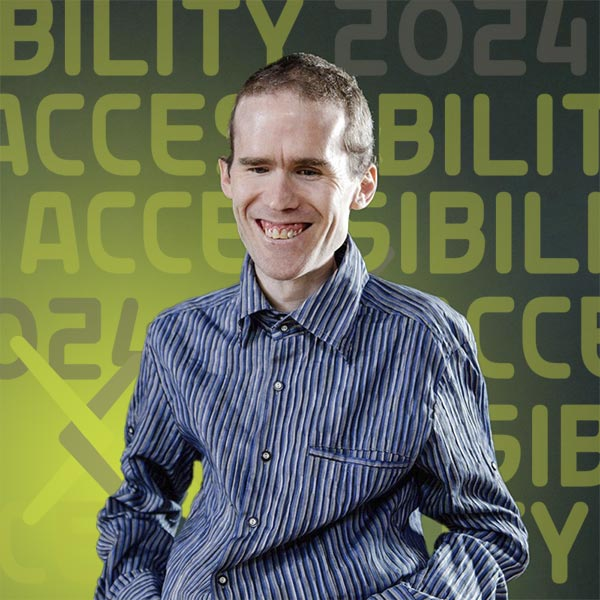
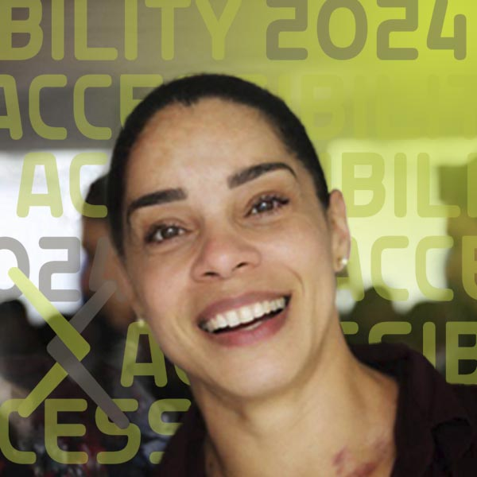
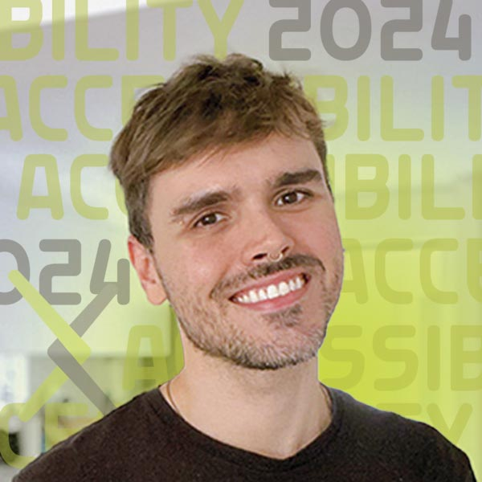
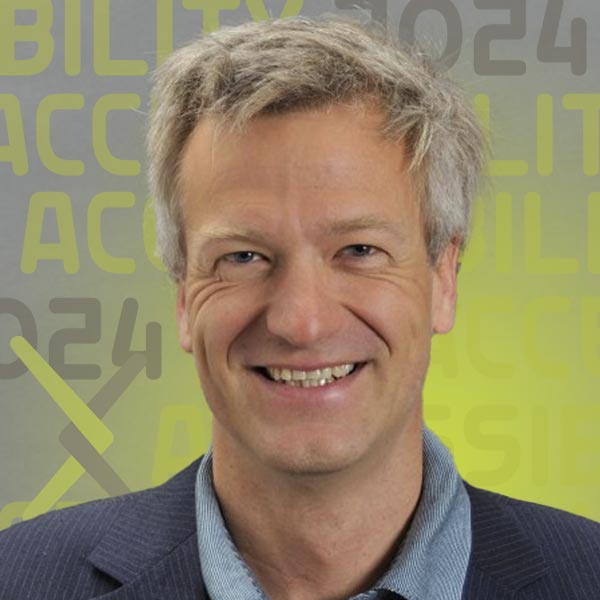
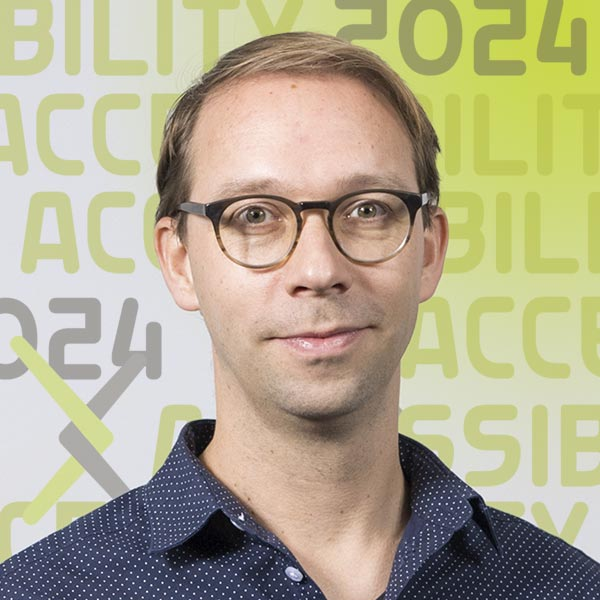

# Presenter bios

We are very pleased to be working with the following distinguished participants from across a wide variety of fields to bring this forum to life.

## Arwa Alnajashi

{.mkd-img-left .mkd-img-profile alt='An image of an iconic building in Saudi Arabia, the Al Faisaliah Tower in Riyadh'}

**Data Scientist, Saudi Aramco.**

Arwa's passion lies in creating an empowered and inclusive digital future, ensuring that advancements in technology pave the way for greater accessibility and efficiency across industries. Currently, she applies data science to automate critical operations in the oil and gas industry. [Arwa's LinkedIn Page](https://sa.linkedin.com/in/arwa-alnajashi-84b1541a2?trk=people-guest_people_search-card){target="_blank"}

---

## Elizabeth Ayers

{.mkd-img-left .mkd-img-profile alt='Headshot of Liz wearing a black shirt against a dark grey background'}

**Senior Lecturer, Department of Science and Mathematics and Director of Healthcare Mentoring, Deaf Healthcare and Biomedical Sciences Hub (Deaf Hub), National Technical Institute for the Deaf at Rochester Institute of Technology.**

Liz is a sonographer at Highland Hospital and science instructor at NTID/RIT teaching science to deaf and hard of hearing undergraduate students. She runs the Mentor Supported Shadowing Program at Deaf Hub. In addition, Liz is a current University at Buffalo doctoral student almost at dissertation. [Liz's RIT profile](https://www.rit.edu/directory/ewants-elizabeth-ayers){target="_blank"}

---

## Kim Bryant

{.mkd-img-left .mkd-img-profile alt='Headshot of Kim wearing a flowered shirt against a wooden wall'}

**Senior Staff Product Manager in Accessibility, Mozilla; Co-Founder of Disability@Mozilla, an internal employee resource group.**

Kim brings her expertise in interpreting accessibility through the lens of social sciences and empowering people with customizable accessibility toolboxes. In addition to her work at Mozilla, Kim is currently a Master's student in Disability Studies at the City University of New York (CUNY). [Kim's LinkedIn profile](https://www.linkedin.com/in/kimbryant/){target="_blank"}

---

## Michael Curran

{.mkd-img-left .mkd-img-profile alt='Headshot of Michael wearing a blue striped shirt standing against a dark background'}

**Co-Founder and Lead Developer, NV Access Limited (NVDA).**

Mick is the creator of the free and open-source NVDA screen reading software, the world's only open-source screen reader. NVDA has enabled more than 200,000 blind and vision impaired people worldwide to independently use computers. He brings expertise in accessibility for the web, international standards, software APIs, and best practice approaches to functional usability. [Mick's LinkedIn profile](https://au.linkedin.com/in/mdcurran){target="_blank"}

---

## Phia Damsma

{.mkd-img-left .mkd-img-profile alt='Headshot of Phia Damsma in black-rimmed glasses against a white background'}

**Co-Founder and Creative Director, Sonokids Australia.**

Phia has more than 25 years of experience building innovative educational software and mobile apps for children with special needs, especially kids who are blind and low-vision. Her not-for-profit social enterprise, Sonokids, is impacting children globally, supporting playful learning with fundamental technology and other Expanded Core Curriculum skills through the technique of sonification. [Phia's LinkedIn profile](https://au.linkedin.com/in/phia-damsma-18b3a29){target="_blank"}

---

## Dr. Wanda Diaz-Merced

{.mkd-img-left .mkd-img-profile alt='Headshot of Wanda smiling, wearing a dark navy shirt against a dark background'}

**Program Lead, European Gravitational Wave Observatory; Director, Arecibo Observatory.**

Wanda is an astronomer and leading proponent of sonification, converting astrophysical data into audible sound. Named one of the Seven most Trailblazing Women in Science by the BBC, Wanda is a leader in increasing equality of access within astronomy and raising awareness of the broad benefits of sonification in scientific research. [Wanda's Wikipedia page](https://en.wikipedia.org/wiki/Wanda_D%C3%ADaz-Merced){target="_blank"}

---

## Hannah DeFelice

{.mkd-img-left .mkd-img-profile alt='A night photograph of Rochester's iconic city skyline with the famous Frederich Douglas and Susan B Anthony bridge in the foreground'}

**Master's Student in Environmental Science, Rochester Institute of Technology.**

Hannah’s research focuses on permaculture, especially carbon cycles and their impact. [Hannah's profile](){target="_blank"}

---

## Dr. Solange Maria dos Santos

{.mkd-img-left .mkd-img-profile alt='Candid photo of Solange smiling with a crowd of people in the background'}

**Production and Publishing Coordinator, SciELO.**

Solange brings in scientific communication expertise in diverse geographical contexts, such as Argentina, Bolivia, Colombia, Mexico, Paraguay, and South Africa. Solange is a strong advocate for accessibility in open archive space as well as academic journals. [Solange's LinkedIn profile](https://www.linkedin.com/in/solangemariasantos/?originalSubdomain=br){target="_blank"}

---

## Dr. Scott Fleming

{.mkd-img-left .mkd-img-profile alt='Headshot of Scott wearing glasses and smiling against a background image of a galaxy'}

**Archive Scientist at the Mikulski Archive for Space Telescopes (MAST), Space Telescope Science Institute (STScI).**

Scott studies stars and exoplanets in the ultraviolet, optical, and infrared. He is one of the movers and shakers behind Astronify, an open-source sonification tool written in Python and used for analyzing data from NASA’s space telescopes. [Scott's STSI profile](https://www.stsci.edu/stsci-research/research-directory/scott-fleming){target="_blank"}

---

## Deyan Ginev

{.mkd-img-left .mkd-img-profile alt='Headshot of Deyan outdoors with a river in the background'}

**Creator of ar5iv.org and lead developer at LaTeXML; W3C Math Working Group Member; Ph.D. candidate in hiding (do not disturb).**

Deyan's main focus is to enhance the representation of mathematical expressions in rendered research papers, improving their accessibility, computational semantics, and enabling further reuse in a broader class of applications. [Deyan's Kwarc profile](https://kwarc.info/people/dginev/){target="_blank"}

---

## Dr. Jonathan Godfrey
{.mkd-img-left .mkd-img-profile alt='Headshot of Jonathan Godfrey smiling in a suit'}

**Senior Lecturer in Statistics, School of Mathematical and Computational Sciences, Massey University.**

Jonathan's research is focused on the needs of the thousands of blind people around the world who rely on additional tools to make the visual elements of statistical thinking and practice less of a barrier. In addition, Jonathan was a core consultant to arXiv's efforts towards HTML papers. [Jonathan's Faculty profile](https://www.massey.ac.nz/massey/expertise/profile.cfm?stref=416430){target="_blank"}

---

## Ricardo Enrique Gonzalez
{.mkd-img-left .mkd-img-profile alt='Headshot of Ricardo in a dark shirt against a light grey background'}

**Ph.D. Candidate in Information Science, Cornell Tech.**

Ricardo designs interactive systems that empower people of disabilities, particularly Blind and Low Vision users, in 3D virtual environments, data analysis, AI powered systems, and mobile cameras. [Ricardo's GitHub homepage](https://rgonzalezp.github.io/){target="_blank"}

---

## Dr. Mar Gonzalez-Franco
{.mkd-img-left .mkd-img-profile alt='Black and white headshot of Mar smiling and looking thoughtfully upwards to the left while holding her chin'}

**Editor and Ethics and Diversity Chair, IEEE VGTC; Research Scientist, Google.**

Mar is a Computer Scientist and Neuroscientist working on a new generation of Immersive technologies and generative AI. To the forum, she brings in 4 years of expertise as the Ethics and Diversity Chair of IEEE VGTC, where she has significantly forwarded accessibility standards and regional diversity. [Mar's GitHub homepage](https://margonzalezfranco.github.io/){target="_blank"}

---

## Dr. Bonnie Jacob
{.mkd-img-left .mkd-img-profile alt='Headshot of Bonnie against a clear dark grey background'}

**Associate Professor, Department of Science and Mathematics and National Technical Institute for the Deaf, Rochester Institute of Technology.**

Bonnie is passionate about promoting undergraduate research in mathematics as well as STEM in general, particularly among deaf and hard-of-hearing students. She is a mathematician by training, specializing in graph theory and combinatorial matrix theory. [Bonnie's RIT profile](https://www.rit.edu/directory/bcjntm-bonnie-jacob){target="_blank"}

---

## Sarah Kane

{.mkd-img-left .mkd-img-profile alt='Headshot of Sarah Kane smiling in a forest'}

**Ph.D. Candidate in Astrophysics, Institute of Astronomy, University of Cambridge.**

For Sarah, her career as a researcher is intertwined with her work as a disability advocate. She was born legally blind and has a strong interest in the accessibility of science to people with disabilities. Her work includes usability testing for Astronify, a project of the Space Telescope Science Institute turning datasets into audio. [Sarah's LinkedIn profile](https://uk.linkedin.com/in/sarah-kane-4a9414220){target="_blank"}

---
## Dr. Leif Karlstrom

{.mkd-img-left .mkd-img-profile alt='Upper-body shot of Leif Karlstrom standing in front of a snowy mountain with rough surfaces'}

**Associate Professor, Department of Earth Sciences, University of Oregon.**

Leif is an Earth scientist with main research areas in fluid motions in and on volcanoes and glaciers, landscape evolution, and geodynamics. He is also the creator and owner of the Volcano Listening Project. [Leif's faculty profile](https://uonews.uoregon.edu/leif-karlstrom-department-earth-sciences){target="_blank"}

---

## Dr. Devva Kasnitz
{.mkd-img-left .mkd-img-profile alt='Headshot of Devva Kasnitz in a red sweater and a red scarf against a white background'}

**Research Director, Disability History and Culture Collective and Adjunct Professor, CUNY.**

Devva's research work in disability studies spans more than 40 years at four distinguished universities. Her current work focuses on speech impairment, social participation politics, and disability services in higher education. With friends, she edited the book, "Occupying Disability," which explores concepts that consider disability not in terms of impairment but as a range of unique social identities and experiences. [Devva's Faculty Profile](https://sps.cuny.edu/about/directory/devva.kasnitz){target="_blank"}

---

## Dyl Levenson

{.mkd-img-left .mkd-img-profile alt='Headshot of Dyl in a dark grey polo with the RIT logo on the lapel standing against a dark grey background'}

**Biomedical Science Training Grants Admin, National Technical Institute for the Deaf, Rochester Institute of Technology.**

Dyl is the coordinator for undergraduate and graduate research training programs in the biomedical, biobehavioral, and clinical fields at Deaf Hub. He is also a grad student in health systems management. [Dyl’s RIT profile](https://www.rit.edu/directory/djldhb-dyl-levenson){target="_blank"}

---

## Dr. Anne Kearney Logan

{.mkd-img-left .mkd-img-profile alt='Headshot of Anne Logan smiling against a white background'}

**Adjunct Professor, Gallaudet University.**

A horticulturalist with a focus in Viticulture and Enology, Anne currently teaches as an adjunct professor at Gallaudet University and creates STEM videos for deaf / HoH children for educational game app company ASL Aspire. She soon will launch her own wine education program in ASL. [Anne's LinkedIn profile](https://www.linkedin.com/in/anne-k-logan-9a75b989/){target="_blank"}

---

## Luisa de Souza Leão  

{.mkd-img-left .mkd-img-profile alt='an image of a beautiful natural scenic area in Brazil featuring a rocky coastline and island outcroppings near the shore'}

**Master's Student in Special Education, Federal University of São Carlos (UFSCar).**

A psychologist by training, Luisa brings her expertise at the intersection of psychology, education and accessibility as well as her lived experience as an academic with a visual impairment. Outside her research career, she is a member of the Permanent Accessibility and Inclusion Committee of the Regional Labor Court of the 8th Region in Brazil. [Luisa's profile](){target="_blank"}

---

## Tony Malykh

{.mkd-img-left .mkd-img-profile alt='Headshot of Tony Malykh wearing dark sunglasses against a tan background'}

**Software Engineer, Meta.**

Tony is a researcher in Machine Learning at Meta, an active contributor to the NVDA open-source screen reader codebase, as well as a consultant to arXiv's accessibility research project. [Tony's GitHub profile](https://github.com/mltony){target="_blank"}

---

## Dr. Carmody McCalley

{.mkd-img-left .mkd-img-profile alt='Headshot of Carmody in a blue blazer smiling against a grey background'}

**Associate Professor in Life Sciences and Director of Environmental Science MS Program, Rochester Institute of Technology.**

Carmody's research focuses on better understanding ecosystem and climate interactions like the thawing of the Arctic permafrost. Carmody will share her experiences working with and supporting students with accessibility needs on their academic journeys, both in and outside the classroom. [Carmody's Faculty profile](https://www.rit.edu/directory/ckmsbi-carmody-mccalley){target="_blank"}

---

## Alex Mendonça

{.mkd-img-left .mkd-img-profile alt='Headshot of Alex Mendonça smiling in an indoor environment'}

**Online Submission & Preprints Coordinator, SciELO.**

Alex brings expertise in organizational strategies in transitioning from indexed journals to open science, as well as the implementation of Diversity, Equity, Inclusion and Accessibility (DEIA) policies at SciELO. [Alex's LinkedIn profile](https://www.linkedin.com/in/alex-mendon%C3%A7a/?originalSubdomain=br){target="_blank"}

---

## Kate Meredith

{.mkd-img-left .mkd-img-profile alt='Headshot of Kate in a red sweater against a grey background'}

**Founder and President, Geneva Lake Astrophysics and STEAM (GLAS) Education.**

Kate is committed to ensuring that all who want the opportunity to pursue careers in STEAM have the chance to do so, with a clear focus on accessibility and multigenerational engagement. Some of her projects at GLAS include creating accessible curricula and data analysis software, and hosting summer intern programs and public star parties. [Kate's LinkedIn profile](https://www.linkedin.com/in/kmeredith){target="_blank"}

---

## Camille Ouellette

{.mkd-img-left .mkd-img-profile alt='Headshot of Camille in a suit and wearing black-rimmed glasses standing against a grey background'}

**Senior Lecturer of Biology and Health Sciences at Rochester Institute of Technology; Deaf Hub Affiliate.**

Camille teaches in the Biology and Health department on Human Health and Disease, and is an active faculty member supporting deaf and hard of hearing (DHH) researchers throughout their academic journeys. Camille empowers students by connecting them to the resources they need. [Camille's RIT profile](https://www.rit.edu/directory/ceonts-camille-ouellette){target="_blank"}

---

## Dr. Venkatesh Potluri

{.mkd-img-left .mkd-img-profile alt='Headshot of Venkatesh in an orange plaid shirt against a white background'}

**Assistant Professor, School of Information, University of Michigan.**

Venkatesh examines accessibility barriers experienced by blind or visually impaired (BVI) developers participating in professional programming domains such as user interface design, data science, and physical computing. His work contributes real-world systems to improve developer tools and new interaction techniques. [Venkatesh's Homepage](https://venkateshpotluri.me/){target="_blank"}

---

## Dr. Norbert Preining

{.mkd-img-left .mkd-img-profile alt='Headshot of Norbert in a blue shirt and blazer smiling against a grey background'}

**Principal Software Engineer, arXiv.**

As the author of TeXLive (and though he objects to this characterization) Norbert is one of the world's leading experts on TeX. He joined arXiv in 2023 and is actively engaged in ongoing efforts to improve arXiv submission and HTML formatted papers. [Norbert's Homepage](https://www.preining.info/){target="_blank"}

---

## Dr. Thijs Jan Roumen

{.mkd-img-left .mkd-img-profile alt='Headshot of Thijs Roumen against a grey background'}

**Assistant Professor of Information Science and Director of the Matter of Tech Lab, Cornell Tech.**

Thijs' research focus is digital fabrication, a nascent subfield of human-computer interaction (HCI). He aims to create a technological basis that allows designers and engineers to build on each other's work and enable personal, custom fabrication relevant to everyone, not only to industrialists and hobbyists. [Thijs's Homepage](http://thijsroumen.eu/){target="_blank"}

---
## Dr. Ashley Shew

{.mkd-img-left .mkd-img-profile alt='Headshot of Ashley outdoors with the sun shining brightly on the lawn in the background'}

**Associate Professor of Science, Technology, and Society, Virginia Tech.**

Ashley specializes in disability studies and technology ethics and believes in cross-disciplinary, cross-disability, and public-facing scholarship. She is the author of Against Technoableism (2023) and Animal Constructions and Technological Knowledge (2017) and the co-editor-in-chief of *Techné: Research in Philosophy and Technology*. To the forum, she will bring in insights from her latest book and explore the harmful belief that the disabled simply await being 'fixed' by technological wizardry instead of making society more accessible and equitable. [Ashley's Faculty page](https://liberalarts.vt.edu/departments-and-schools/department-of-science-technology-and-society/faculty/ashley-shew.html){target="_blank"}

---

## Jenna Stewardson 	

{.mkd-img-left .mkd-img-profile alt='Headshot of Jenna Stewardson smiling in a blue and white checkered shirt and a navy blazer against a dark grey background'}

**Research Program Coordinator, National Technical Institute for the Deaf, Rochester Institute of Technology.**

Jenna is the research coordinator extraordinaire at Deaf Hub and will be sharing her experiences supporting students who are deaf/hard-of-hearing on their academic journeys. [Jenna’s RIT profile](https://www.rit.edu/directory/jasccl-jenna-stewardson){target="_blank"}

---

## Dr. Licia Verde
{.mkd-img-left .mkd-img-profile alt='Headshot of Licia with dramatic lighting against a dark background'}

**Editor and Scientific Director of the Journal of Cosmology and Astroparticle Physics (JCAP); ICREA Professor, Institute of Cosmological Sciences, University of Barcelona.**

Licia's research is primarily on large-scale structure, analysis of the WMAP data, and development of rigorous statistical tools to analyze surveys of the universe. Licia brings multiple perspectives to her efforts in accessibility as an editor, researcher, author, and teacher. She is also a champion of open science and has served as Chair of the Science Advisory Committee at arXiv since 2019. [Licia's Faculty page](https://liciaverde.icc.ub.edu/){target="_blank"}

---

## Dr. Robin Williams
{.mkd-img-left .mkd-img-profile alt='An image of the famous Big Ben clocktower and the houses of parliament in London, England'}

**Data analyst, Atass Sports.**

Robin completed his PhD in statistical methods for weather forecasting, before moving to industry where he works as a research statistician in sports prediction. During his PhD he helped to develop the Sonify R package, which he uses regularly to convert 2D data to sound. He also has an interest in anything that helps to make STEM subjects more accessible to visually impaired people. [Robin’s R Package Page](https://cran.r-project.org/web/packages/sonify/index.html){target="_blank"}

---

## Dr. Raafat Mahmoud Zaini
{.mkd-img-left .mkd-img-profile alt='Headshot of Raafat Zaini in a purple shirt against a background of greenery'}

**Assistant Professor, College of Integrated Science and Engineering, James Madison University.**

Raafat specializes in modeling dynamic systems, with a research focus that encompasses organizational design, dissent, change, strategy, cognitive learning, higher education, and human systems. Bringing a wealth of practical experience to his academic pursuits, Raafat teaches systems thinking, creative problem-solving, and designing future-forward organizations. Most recently, he has been passionate about harnessing generative AI to improve accessibility for visually impaired and neurodiverse learners. [Raafat's Faculty page](https://www.jmu.edu/cise/people/faculty/zaini-raafat.shtml){target="_blank"}

---

## Allie Zombron
{.mkd-img-left .mkd-img-profile alt='Headshot of Allie  smiling in a green sweater in a classroom setting'}

**Fourth-year undergraduate student, James Madison University.**

Allie's research focuses on pairing AI with systems thinking to drive inclusivity in STEM Education. She will share her project that uses AI to explain, interpret and verbalize flow chart visualizations, a common presentation choice in academic research outputs. Analyzing such figures and turning them into words greatly enhances their accessibility for visually impaired academics. [Allie's LinkedIn Page](https://www.linkedin.com/in/allie-zombron-87394a290/){target="_blank"}

---
 

# Facilitators
## Shamsi Brinn
{.mkd-img-left .mkd-img-profile alt='Headshot of Shamsi outdoors against a leafy background'}

**UX Manager, arXiv.**

For the last few years Shamsi has championed the research and implementation of more accessible practices at arXiv, including the addition of HTML-formatted papers. She has also had the pleasure of organizing this forum and working with each of the wonderful participants above to bring it to life. Thank you! [Shamsi's LinkedIn profile](https://www.linkedin.com/in/shamsi-brinn/){target="_blank"}

## Miranda Yang
{.mkd-img-left .mkd-img-profile alt='Headshot of Miranda smiling against a clear white background'}

**UX Specialist, arXiv.**

Miranda is a researcher that puts users front and center in her work and has a bias for impact. Her contribution in accessibility at arXiv has spanned across generative interviews with researchers of visual impairment, the roll-out of the HTML paper feature, and the shaping of this forum. [Miranda's LinkedIn profile](https://www.linkedin.com/in/miranda-jingqiong-yang/){target="_blank"}

{#no-giscus}

<!-- ---

## Joshua Miele

{.mkd-img-left .mkd-img-profile alt='Headshot of Joshua Miele smiling against a greenery'}

Principal Accessibility Researcher, Amazon Lab126; 2021 MacArthur Foundation Fellow.

Josh specializes in accessible technology design with previous research projects on tactile graphics and auditory displays. Additionally, he is an expert in effective giving and philanthropy in the accessible science space.

---

## Sina Bahram

{.mkd-img-left .mkd-img-profile alt='Headshot of Sina Bahram sitting  on a sofa holding an iPad'}

Founder, Prime Access Computing.

Sina is a blind computer scientist, consultant, entrepreneur, and researcher. He brings expertise in inclusive design  in an operationally scalable and sustainable manner, be it a website, a mix-reality experience, or an entire museum.

---

## Dr. Patrick Smyth

{.mkd-img-left .mkd-img-profile alt='Headshot of Patrick Smyth against a clear grey background'}

Chief Learner, Iota School; Staff Developer Relations Engineer, Chainguard.

Patrick is a blind hacker and programmer whose work focuses on citizen technology, critical infrastructure, accessibility, and technical pedagogy. [Patrick's Homepage](https://smythp.com/index.html){target="_blank"} -->
