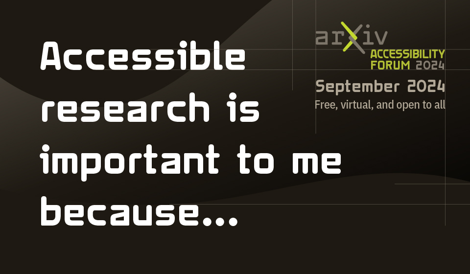
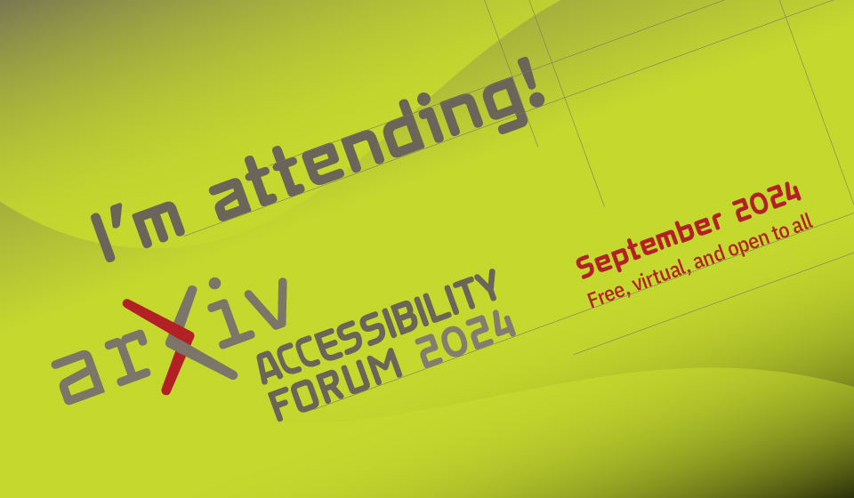
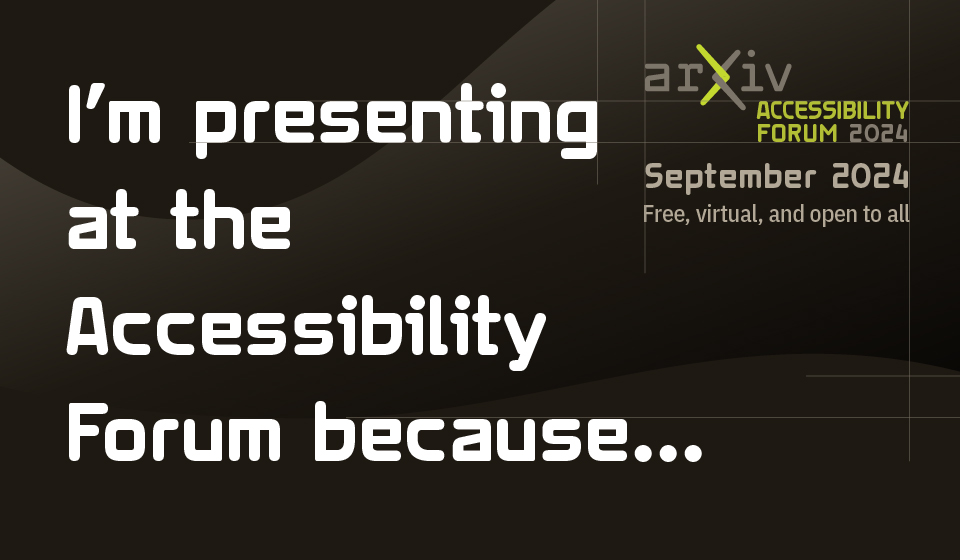
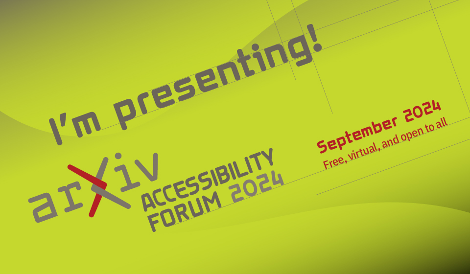

# Sharing the Forum with others

Help spread the word! The Accessibility Forum is free and open to all. Below are links and posters available to use on social media or other channels. We appreciate your sharing the forum with your networks and raising awareness around the need for greater accessibility in research.
[hi](hello)

## Forum sign up link
```
https://cornell.ca1.qualtrics.com/jfe/form/SV_eEZ1d27LF2fVM7Y
```

## Forum website link
```
https://accessibility2024.arxiv.org
```

## Attendee and Presenter "badges"
Images to use in social media posts as an attendee or as a presenter. Attendee Badge 1 and Presenter Badge 1 are prompts for your own message. Attendee Badge 1 says "Accessible research is important to me because..." while Presenter Badge 1 says "I'm presenting at the Accessibility Forum because..."

<div class="logo-background">
  <ul style="justify-content: flex-start;">
    <li><a target="_blank" href="../assets/share/attendee-badge-1.jpg">Attendee Badge #1</a></li>
    <li><a target="_blank" href="../assets/share/attendee-badge-2.jpg">Attendee Badge #2</a></li>
    <li><a target="_blank" href="../assets/share/presenter-badge-1.jpg">Presenter Badge #1</a></li>
    <li><a target="_blank" href="../assets/share/presenter-badge-2.jpg">Presenter Badge #2</a></li>
  </ul>
</div>


## Logos
| Asset name | Thumbnail | Download link |
|---|:---:|---|
| Full logo | { alt='logo for the arXiv forum' role="presentation" style="height: 65px;" target="_blank"} | [Download logo](https://cornell.box.com/v/2024-logo-full) |
| Minimal logo | { alt='logo for the arXiv forum' role="presentation" style="height: 25px;" target="_blank"} | [Download minimal](https://cornell.box.com/v/2024-logo-mini) |
| Forum title graphic | { alt='logo for the arXiv forum' role="presentation" style="height: 55px;" target="_blank"} | [Download title graphic](https://cornell.box.com/v/2024-forum-title) |

## Event poster
Click to open full size in a new tab. This poster is sized for Twitter/X and LinkedIn.

[](../assets/share/forum-poster-general.jpg){target="_blank" alt="Event poster for the arXiv Accessibility Forum with the forum title and the slogan Converging on accessible science together"}


## Session Posters
Click on a poster thumbnail to open full size in a new tab. They are sized for use on Twitter/X or LinkedIn.

<div class="logo-background">
  <ul style="justify-content: flex-start;">
    <li><a target="_blank" href="../assets/share/forum-poster-AMA.jpg">Ask Me Anything</a></li>
    <li><a target="_blank" href="../assets/share/forum-poster-AI.jpg">AI and Accessibility</a></li>
    <li><a target="_blank" href="../assets/share/forum-poster-deafhub.jpg">Deaf Hub at RIT</a></li>
    <li><a target="_blank" href="../assets/share/forum-poster-sonification.jpg">Sonification</a></li>
    <li><a target="_blank" href="../assets/share/forum-poster-SciELO.jpg">SciELO</a></li>
    <li><a target="_blank" href="../assets/share/forum-poster-html.jpg">HTML papers on arXiv</a></li>
    <li><a target="_blank" href="../assets/share/forum-poster-disability-model.jpg">Disability Models</a></li>
  </ul>
</div>
***

If you want to suggest groups we should reach out to please [email](mailto:accessibility@arxiv.org) or let us know in the discussion board below. Learn more about participating in discussions with our [getting started](getting-started.md) guide.
